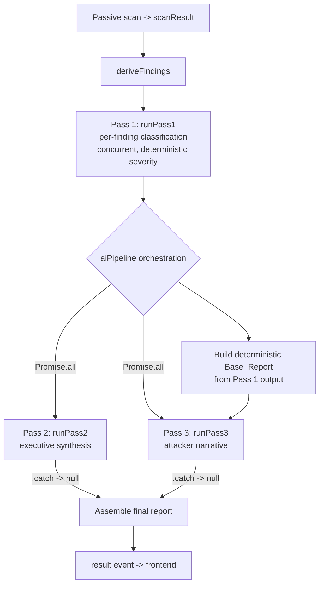

# Design Document

## Overview

Analyst Synthesis (Pass 2) is the executive-synthesis stage of the multi-pass AI analysis pipeline. It runs after the passive domain scan and after Pass 1 has classified each finding. Its job is to turn a set of per-finding classifications into a single executive narrative for a non-technical business owner — a plain-English `summary` and a one-sentence `topPriority` — while computing the overall risk score and risk level **deterministically**, never delegating that to the model.

The stage is implemented by `runPass2` in `netlify/functions/lib/analysis.js`, supported by the deterministic helpers `computeFallbackScore`, `scoreToLevel`, `sortFindings`, `synthFallbackSummary`, and `buildFallbackReport`. It is orchestrated by the `aiPipeline` logic in `netlify/functions/scan.js`, which runs Pass 2 concurrently with Pass 3. The single LLM round-trip is performed by `callLLMJson` in `netlify/functions/lib/llm.js`.

The defining architectural principle is a **strict separation between deterministic computation and LLM-generated prose**:

- **Deterministic (authoritative):** the overall risk score, the risk level, the ordering of findings, and the entire fallback report. These are computed from fixed per-severity weights and thresholds *before* any model call and are never overridden by model output.
- **LLM-generated (prose only):** the `summary` and `topPriority` strings. The model is explicitly forbidden from emitting its own score or level, and any such value it returns is ignored by construction (the engine simply never reads it).

This separation guarantees that identical findings always produce an identical score and level across repeated scans, that a misbehaving or unavailable model can never alter the reported risk, and that the stage always produces a complete report — even when the model omits fields, fails to parse, throws, or times out, and even when there are no findings at all (in which case the model is not called).

This document describes the existing, working behavior. It is documentation of shipped code, not a proposal for new code.

## Architecture

### Position in the pipeline



Pass 2 and Pass 3 are launched together with `Promise.all`, each guarded by its own independent `.catch(() => null)`. Pass 3 is fed a deterministic `Base_Report` derived solely from Pass 1's classified findings — **not** from Pass 2's output — so the two stages share no data dependency and a full LLM round-trip is removed from the critical path.

### Internal flow of `runPass2`

```mermaid
flowchart TD
    A[runPass2 classified, domain, tech] --> B[sortFindings:<br/>order by severity desc, stable]
    B --> C{sorted.length == 0?}
    C -->|yes| D[Zero-findings path:<br/>score 5, Low,<br/>templated 'no notable exposures',<br/>findings [], _source 'none'<br/>NO LLM CALL]
    C -->|no| E[computeFallbackScore -> score<br/>scoreToLevel -> riskLevel<br/>BEFORE any LLM call]
    E --> F[Build prompt: score + level<br/>as authoritative read-only context]
    F --> G[callLLMJson<br/>single call, timeoutMs 10000]
    G -->|success| H[report = deterministic score/level/findings<br/>+ summary or templated fallback<br/>+ topPriority or top recommendation<br/>_source 'llm']
    G -->|throw / timeout / parse fail| I[buildFallbackReport:<br/>deterministic score/level/findings<br/>templated summary,<br/>top recommendation,<br/>_source 'fallback']
```

The critical invariant visible in this flow: `score` and `riskLevel` are computed at step E, *before* the LLM call at step G, and the success path (H) reuses exactly those values. The LLM response only ever contributes the `summary` and `topPriority` strings.

### The single LLM call

`callLLMJson` performs **one logical model request**. Internally it may make a second HTTP attempt with a stricter "return only JSON" instruction *if and only if* the first attempt's response fails to parse as JSON. From Pass 2's perspective this is a single call: Pass 2 invokes `callLLMJson` exactly once for a non-empty finding set and never loops over findings. The internal retry is a parse-robustness mechanism inside the client, not an additional synthesis call. If both internal attempts fail to parse (or the request errors or aborts on the abort-controller timeout), `callLLMJson` throws and Pass 2 falls back deterministically.

## Components and Interfaces

### `runPass2(classified, domain, tech)` — the synthesis stage

- **Inputs:**
  - `classified`: an array of Classified_Finding objects from Pass 1.
  - `domain`: the scanned domain string.
  - `tech`: optional detected-technology context (`{ detected: string[] }`); used only to add a context line to the prompt and is never treated as a vulnerability.
- **Output:** a report fragment `{ overallRiskScore, riskLevel, summary, findings, topPriority, _source }`.
- **Behavior:** sorts findings, branches on empty vs non-empty, computes deterministic score/level, makes at most one LLM call, applies prose fallbacks on a successful-but-incomplete response, and falls back to `buildFallbackReport` on any failure.

### Deterministic helpers (no LLM involvement)

- `sortFindings(findings)` — returns a new array sorted by `SEVERITY_RANK` descending (`critical:4, high:3, medium:2, low:1`; any other/absent severity ranks 0). Uses a stable sort over a copied array, preserving the relative order of equal-rank findings.
- `computeFallbackScore(findings)` — sums per-severity `weights` (`critical:40, high:22, medium:10, low:3`; everything else contributes 0) and returns `Math.min(100, score)`.
- `scoreToLevel(score)` — bands the score: `>=70 → "Critical"`, `>=45 → "High"`, `>=20 → "Medium"`, else `"Low"`.
- `synthFallbackSummary(domain, findings)` — builds the templated summary naming the domain, the total finding count, and the per-severity counts (critical/high/medium/low).
- `buildFallbackReport(domain, sortedFindings)` — assembles the full deterministic report: deterministic score and level, templated summary, the sorted findings, `topPriority` = the first sorted finding's `recommendation` (or a default no-action string when empty), and `_source: "fallback"`.

### `callLLMJson(opts)` — the LLM client (in `lib/llm.js`)

- Wraps `callLLM` (OpenAI Chat Completions via global `fetch`) in JSON mode.
- Attempt 1: request with `jsonMode: true`, then `extractJson` the response.
- Attempt 2 (only on a thrown/parse failure of attempt 1): re-request with a stricter "return ONLY raw JSON" system suffix, then `extractJson`.
- Throws if the second attempt also fails. Honors `timeoutMs` via an `AbortController` (Pass 2 passes `timeoutMs: 10000`).

### `aiPipeline` orchestration (in `scan.js`)

- Runs Pass 1 (`runPass1`), emitting progress ticks.
- Builds `baseReport = buildFallbackReport(domain, sortedClassified)` from Pass 1 output.
- Launches Pass 2 and Pass 3 concurrently:
  ```js
  const [pass2Rep, narrative] = await Promise.all([
    runPass2(classified, domain, techStack).catch(() => null),
    runPass3(baseReport, domain).catch(() => null),
  ]);
  ```
- `rep = pass2Rep || baseReport` — if Pass 2 produced no usable result, the deterministic base report is substituted, preserving the deterministic score/level/findings.
- Attaches provider, domain, and tech stack; appends Pass 3 narrative fields only if present.
- The whole pipeline is additionally bounded by a fixed `ANALYSIS_BUDGET_MS` wall-clock race in the handler; if exceeded, the instant `deterministicReport()` is shipped.

## Data Models

### Classified_Finding (input, from Pass 1)

```js
{
  id: string,
  type: string,
  title: string,
  severity: "critical" | "high" | "medium" | "low" | "info" | (other),
  explanation: string,
  recommendation: string,
  fixSnippet: string | null,
  _source: "llm" | "fallback"
}
```

`severity` is always the deterministic rule-based value assigned in Pass 1; the model never sets it.

### Report fragment (output of `runPass2`)

```js
{
  overallRiskScore: number,   // integer 0..100 (deterministic), or fixed 5 for zero findings
  riskLevel: "Critical" | "High" | "Medium" | "Low",  // deterministic
  summary: string,            // LLM prose OR templated fallback
  findings: Classified_Finding[],  // sorted by severity desc (empty for zero-findings)
  topPriority: string,        // LLM prose OR top finding's recommendation OR maintenance text
  _source: "llm" | "fallback" | "none"
}
```

### Severity weights and ranks (fixed constants)

| Severity | Score weight | Sort rank |
|----------|-------------|-----------|
| critical | 40 | 4 |
| high | 22 | 3 |
| medium | 10 | 2 |
| low | 3 | 1 |
| info / other / absent | 0 | 0 |

### Risk level bands

| Score range | Risk_Level |
|-------------|-----------|
| 70–100 | Critical |
| 45–69 | High |
| 20–44 | Medium |
| 0–19 | Low |

### Source tagging

| `_source` | Meaning |
|-----------|---------|
| `"llm"` | Successful LLM response used for prose; score/level deterministic |
| `"fallback"` | LLM failed (throw / timeout / parse) — full deterministic Base_Report |
| `"none"` | Zero findings — LLM skipped entirely, fixed score 5 / Low |

### LLM request shape (authoritative context)

The user message embeds a JSON object including `domain`, `overallRiskScore` (the deterministic integer), `riskLevel` (the deterministic band), `detectedTechStack`, and the `findings` (title, severity, explanation). The system prompt declares the provided risk level authoritative, instructs the model to write prose consistent with it, forbids it from emitting its own score/level, and requests a JSON object whose only fields are `summary` and `topPriority`.

## Correctness Properties

*A property is a characteristic or behavior that should hold true across all valid executions of a system — essentially, a formal statement about what the system should do. Properties serve as the bridge between human-readable specifications and machine-verifiable correctness guarantees.*

These properties were derived from the acceptance criteria via the prework analysis. Several criteria were consolidated: the "computed before the LLM call" ordering claims (2.3, 3.5) and the "engine always uses deterministic values" claims (5.1–5.4) collapse into one master determinism property; the failure criteria (7.1–7.7) collapse into one fallback property; the zero-findings criteria (8.1–8.7) collapse into one shape property. Fixed prompt-text assertions (4.2, 4.3, 4.4) and specific orchestration-failure combinations (9.1, 9.3, 9.4, 9.6) are example/edge tests rather than properties (see Testing Strategy), and the `callLLMJson` internal-retry mechanic (1.3) is an example test on the client.

All Pass 2 properties are tested with the LLM client replaced by a controllable test double (a spy/stub), so no real network calls occur and 100+ iterations are cheap.

### Property 1: At most one LLM call for any non-empty finding set

*For any* non-empty array of Classified_Findings, and any domain and tech context, invoking `runPass2` results in exactly one invocation of the LLM client, independent of the number of findings.

**Validates: Requirements 1.1, 1.2, 1.3**

### Property 2: No LLM call for an empty finding set

*For any* domain and tech context, invoking `runPass2` with an empty finding set results in zero invocations of the LLM client.

**Validates: Requirements 1.4, 8.1**

### Property 3: Deterministic score is the capped weighted sum within 0..100

*For any* array of Classified_Findings, the computed Overall_Risk_Score equals `min(100, sum of per-finding weights)` where weights are critical = 40, high = 22, medium = 10, low = 3 and every other, absent, or null severity contributes 0 (matched case-insensitively), and the result always lies in the inclusive range 0 to 100.

**Validates: Requirements 2.1, 2.2, 2.4**

### Property 4: Score and level are authoritative — independent of finding order and of LLM output

*For any* array of Classified_Findings, the report's Overall_Risk_Score and Risk_Level are identical across (a) any permutation of the findings, and (b) every LLM outcome — a successful response that omits score/level, one that returns values equal to the deterministic ones, one that returns conflicting values, and a failed call that triggers fallback — and in every case equal the deterministically computed score and the level derived from it.

**Validates: Requirements 2.3, 2.5, 3.5, 3.7, 5.1, 5.2, 5.3, 5.4, 7.5**

### Property 5: Risk level banding is correct and total

*For any* integer score in 0..100, `scoreToLevel` returns exactly one of `Critical`, `High`, `Medium`, `Low`, assigning `Critical` when score ≥ 70, `High` when 45 ≤ score < 70, `Medium` when 20 ≤ score < 45, and `Low` when score < 20.

**Validates: Requirements 3.1, 3.2, 3.3, 3.4, 3.6**

### Property 6: The LLM request carries the deterministic score and level

*For any* non-empty array of Classified_Findings, the request handed to the LLM client contains the deterministically computed Overall_Risk_Score (an integer 0..100) and the derived Risk_Level (one of the four bands).

**Validates: Requirements 4.1**

### Property 7: Valid model prose is used verbatim and tagged "llm"

*For any* non-empty findings and any successful LLM response whose `summary` and `topPriority` are each non-empty strings, the report's Summary and Top_Priority equal those strings verbatim and the Source_Tag is `"llm"`.

**Validates: Requirements 6.1, 6.3, 6.5**

### Property 8: Missing or invalid model prose falls back deterministically

*For any* non-empty findings and any successful LLM response in which `summary` is absent/empty/non-string and/or `topPriority` is absent/empty/non-string, the report's Summary defaults to the templated summary (naming the domain, the total finding count, and the per-severity counts) and/or the Top_Priority defaults to the `recommendation` of the highest-severity (first sorted) finding, respectively.

**Validates: Requirements 6.2, 6.4**

### Property 9: Findings are ordered by severity descending and stably

*For any* array of Classified_Findings, the report's findings are ordered by the fixed rank critical > high > medium > low > any-other, and findings sharing the same severity rank preserve their original relative order.

**Validates: Requirements 6.6**

### Property 10: Any LLM failure yields the deterministic Base_Report

*For any* non-empty findings, when the LLM client throws, aborts on timeout, or fails to parse after its single internal retry, `runPass2` returns the deterministic Base_Report: deterministic score and level, templated summary, findings sorted by severity descending, Top_Priority equal to the first sorted finding's `recommendation`, and Source_Tag `"fallback"`.

**Validates: Requirements 7.1, 7.2, 7.3, 7.4, 7.6, 7.7**

### Property 11: Zero-findings report has the fixed clean shape

*For any* domain, invoking `runPass2` with an empty finding set returns a report with Overall_Risk_Score exactly 5, Risk_Level `Low`, an empty findings list, a Summary that contains the domain verbatim and conveys that no notable exposures were found, a fixed maintenance-oriented Top_Priority string, and Source_Tag `"none"`.

**Validates: Requirements 8.2, 8.3, 8.4, 8.5, 8.6, 8.7**

### Property 12: Pass 3 receives a deterministic base report derived only from Pass 1

*For any* Pass 1 classified output, the report the orchestrator passes to Pass 3 equals `buildFallbackReport(domain, sortedClassified)` — carrying the deterministic score, level, and severity-sorted findings — and contains no field originating from Pass 2 output.

**Validates: Requirements 9.2**

### Property 13: Pass 2 failure substitutes the identical deterministic base report

*For any* Pass 1 classified output, when Pass 2 produces no usable result within the concurrent execution, the orchestrator substitutes the deterministic Base_Report that is identical to the one provided to Pass 3, preserving the deterministic Overall_Risk_Score, Risk_Level, and findings.

**Validates: Requirements 9.5**

## Error Handling

Error handling in this stage is built around graceful degradation to deterministic output — there is no error that should ever prevent a report from being produced.

- **LLM throws or times out:** `callLLMJson` aborts via its `AbortController` after `timeoutMs` (10000 ms for Pass 2) or propagates an API error. `runPass2` catches any thrown error and returns `buildFallbackReport(domain, sorted)` with `_source: "fallback"`. (Property 10)
- **LLM parse failure:** `callLLMJson` retries once internally with a stricter instruction; if the second attempt also fails to parse, it throws, which Pass 2 treats identically to any other failure (deterministic fallback). (Property 10)
- **Partial/incomplete success:** a successful response missing `summary` and/or `topPriority` does not error — the missing prose field is filled from the deterministic templated summary / top-finding recommendation. (Property 8)
- **Model emits a score or level:** never read; the engine always uses its own deterministic values, so a non-conforming response cannot corrupt the risk reporting. (Property 4)
- **Zero findings:** short-circuits before any call, returning the fixed clean report; no error path is exercised. (Property 11)
- **Orchestration-level failures:** Pass 2 and Pass 3 each carry an independent `.catch(() => null)`. A Pass 2 failure substitutes the deterministic base report (`pass2Rep || baseReport`); a Pass 3 failure simply omits the narrative fields. Neither can affect the other. (Properties 12, 13)
- **Pipeline budget exceeded:** the `scan.js` handler races the whole AI pipeline against `ANALYSIS_BUDGET_MS`; if exceeded, an instant `deterministicReport()` is shipped so the scan never hangs.

## Testing Strategy

This feature is well-suited to property-based testing: `runPass2` and its helpers are essentially pure logic over structured inputs (the only impure dependency, the LLM client, is replaced by a test double). Scoring, banding, sorting, prose fallback selection, and source tagging all have universal "for all inputs" statements.

### Property-based tests

- Use a property-based testing library for JavaScript — **fast-check** with the existing test runner (Jest/Vitest). Do **not** hand-roll property testing.
- Implement each of the 13 correctness properties above as a **single** property-based test.
- Run a **minimum of 100 iterations** per property.
- Tag each test with a comment referencing its design property, using the format:
  `// Feature: analyst-synthesis, Property {number}: {property_text}`
- **Generators:** a `Classified_Finding` arbitrary producing random `id`, `title`, `explanation`, `recommendation`, and a `severity` drawn from a set that deliberately includes `critical`, `high`, `medium`, `low`, `info`, mixed-case variants, `null`, and arbitrary strings, so the scoring/sorting properties exercise the 0-weight and rank-0 paths. A domain-string arbitrary for the zero-findings and request-content properties.
- **LLM test double:** a configurable spy/stub injected in place of `callLLMJson` that can (a) count invocations and capture arguments, (b) return a chosen JSON object (including conflicting/missing/non-string fields), or (c) reject (simulating throw / timeout / parse failure). This makes 100+ iterations free of network cost and lets the determinism property (Property 4) sweep all LLM outcomes.
- **Oracles:** the scoring property recomputes the expected capped weighted sum independently; the banding property recomputes the expected band from thresholds; the sort property checks non-increasing rank plus stability via tagged original indices.

### Example-based unit tests

These cover the criteria that are fixed or scenario-specific rather than input-varying:

- **Prompt content (4.2, 4.3, 4.4):** assert `PASS2_SYSTEM` declares the provided risk level authoritative, forbids the model from emitting its own score/level, and requests a JSON object whose only fields are `summary` and `topPriority`.
- **`callLLMJson` internal retry (1.3):** first underlying attempt returns unparseable text, second returns valid JSON — assert one parsed result is returned (and that a single logical `callLLMJson` call maps to two underlying attempts), confirming the retry is not a second synthesis call.
- **Concurrency and independence (9.1, 9.3, 9.4, 9.6):** with Pass 2 and Pass 3 stubbed, verify both are launched via `Promise.all` with independent catches, and assert the four failure combinations: Pass 2 fails → Pass 3 narrative still included with base report substituted; Pass 3 fails → Pass 2 summary kept and narrative fields omitted; both fail → final report is the base report with no narrative fields.

### Why this split

Property tests verify the universal correctness guarantees (deterministic scoring/banding/sorting, authoritative-value independence, prose fallback selection, source tagging, and the deterministic base report fed to Pass 3). Example tests cover fixed prompt wiring and the small set of discrete orchestration failure scenarios, where input variation adds no coverage. Together they comprehensively exercise every acceptance criterion.
