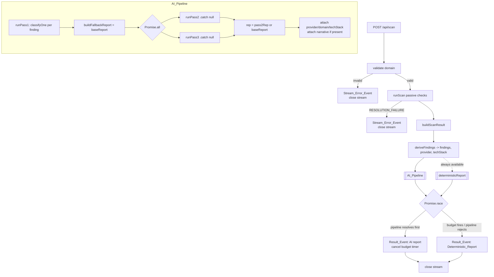
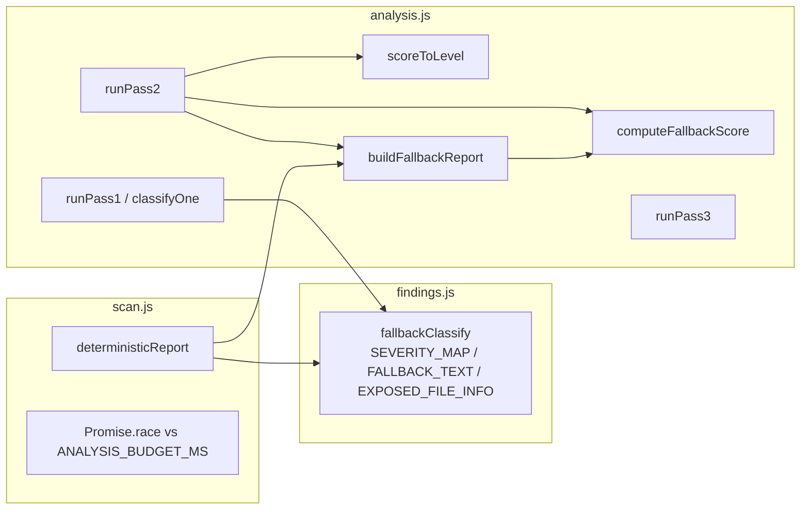

# Design Document

## Overview

This document formalizes an **existing** guarantee in the domain security scanner: a complete,
well-formed report is always delivered to the caller regardless of whether the LLM (Claude) is
available, fails, or times out. This is a documentation / formalization effort — every claim below
is grounded in the current source across `netlify/functions/lib/findings.js`,
`netlify/functions/lib/analysis.js`, and `netlify/functions/scan.js`. Nothing here proposes a
behavioral change.

The guarantee is not produced by a single mechanism. It emerges from **four independent fallback
layers** that compose cleanly because of one invariant that holds at every layer:

> The security-bearing fields of every report — `severity`, `overallRiskScore`, and `riskLevel` —
> are **always** derived deterministically from a fixed rule set. The LLM only ever contributes
> human-readable prose (titles, explanations, recommendations, summaries, narratives).

Because the numbers never depend on the LLM, any layer can drop AI prose at any time and still emit
a correct, internally consistent report. The layers are arranged from finest-grained (a single
finding) to coarsest-grained (the entire pipeline against a wall-clock budget):

| Layer | Scope | Trigger | Result | `_source` |
|-------|-------|---------|--------|-----------|
| 1. Pass 1 per-finding | one finding | `classifyOne` throws/times out | that finding uses `fallbackClassify`; siblings unaffected | `"fallback"` (that finding) |
| 2. Pass 2 whole-report | the report | `runPass2` catch | `buildFallbackReport` over Pass 1 findings (may keep LLM prose) | `"fallback"` |
| 3. Pass 3 narrative | optional fields | `runPass3` returns `null` | `attackScenario` / `ifUnaddressed` simply absent | (unchanged) |
| 4. Top-level budget race | the pipeline | timeout or pipeline rejection | `deterministicReport()` re-derives everything from scratch | `"fallback"` |

A subtle and important point this document makes explicit: **layers 2 and 4 both tag their output
`_source: "fallback"`, yet they produce genuinely different reports for the same findings.** Layer 2
reuses Pass 1's already-classified findings (which may still carry LLM-authored prose); layer 4
discards all LLM work and re-derives every classification from the deterministic rule. They agree on
every number and disagree on prose.

A second important point: **failure selection is latency-driven, not error-typed.** No code anywhere
branches on the kind of LLM error (401 vs 429 vs timeout). Only the *timing* of failure relative to
the 14-second budget determines which layer catches it. A missing API key — which throws instantly —
always settles inside the budget and is therefore caught by layer 2, never layer 4.

### Requirements Coverage Map

| Requirement | Addressed by |
|-------------|--------------|
| 1 — Deterministic severity/score/level | Deterministic Scoring Engine (`fallbackClassify`, `computeFallbackScore`, `scoreToLevel`) |
| 2 — Pass 1 per-finding fallback | Layer 1 — `classifyOne` / `runPass1` |
| 3 — Pass 2 whole-report fallback | Layer 2 — `runPass2` / `buildFallbackReport` |
| 4 — Pass 3 narrative omission | Layer 3 — `runPass3` and the handler's narrative attach |
| 5 — Top-level budget race | Layer 4 — `Promise.race` against `ANALYSIS_BUDGET_MS`, `deterministicReport()` |
| 6 — Latency-driven failure selection | Composition of layers 2 and 4; absence of error-type branching |
| 7 — Known frontend gap | Source_Tag domain documentation; `app.js` dead branch |

## Architecture

### The analysis pipeline

The streaming handler in `scan.js` runs passive checks first (delegated to the scan engine), derives
a flat list of findings, then runs the AI pipeline under a wall-clock budget. The deterministic
report is always computable independently of the AI pipeline — it is the safety net the race falls
back to.



### The budget race

Layer 4 is the outermost net. The AI pipeline is raced against a single `setTimeout` resolving to
`null` after `ANALYSIS_BUDGET_MS` (14000 ms). Whichever settles first wins; `|| deterministicReport()`
supplies the fallback when the race yields `null` (either the timer fired, or the pipeline rejected
and its rejection handler returned `null`).

```mermaid
sequenceDiagram
    participant H as Handler
    participant P as AI_Pipeline
    participant T as Budget timer (14000ms)

    H->>P: start pipeline (Pass1 -> Pass2 || Pass3)
    H->>T: start setTimeout(resolve(null), 14000)
    H->>H: Promise.race([pipeline, budget])

    alt pipeline resolves before timer
        P-->>H: AI report
        H->>T: clearTimeout (cancel)
        H->>H: race -> AI report
        H-->>Client: single Result_Event (AI report)
        Note over T: timer cancelled; never fires
    else pipeline rejects before timer
        P-->>H: rejection -> handler returns null
        H->>T: clearTimeout (cancel)
        H->>H: race -> null  =>  deterministicReport()
        H-->>Client: single Result_Event (Deterministic_Report)
    else timer fires first
        T-->>H: resolve(null)
        H->>H: race -> null  =>  deterministicReport()
        H-->>Client: single Result_Event (Deterministic_Report)
        Note over P: pipeline keeps running; later sends hit a closed stream and are ignored
    end
```

Two timing behaviors are explicit in the code and matter for correctness:

- **Timer cancellation on success.** When the pipeline resolves first, its `.then` handler calls
  `clearTimeout(budgetTimer)` so the timer never fires (Requirement 5.6).
- **Late-fire-ignored.** If the budget timer fires *after* the `Result_Event` was already sent, the
  pipeline's continued execution is harmless: its later `send(...)` calls enqueue onto a closed
  stream and are swallowed by the `try/catch` inside `send`. No second `Result_Event` and no error
  event is ever produced (Requirements 5.7, 5.8).

### Where each layer lives



## Components and Interfaces

### Deterministic Scoring Engine (`findings.js`, `analysis.js`)

The shared foundation every layer relies on. Pure, LLM-free, and the single source of truth for all
security-bearing numbers.

- `fallbackClassify(finding) -> { id, title, severity, explanation, recommendation, fixSnippet }`
  Maps a finding to its deterministic classification. Severity comes from `SEVERITY_MAP` (by `id`),
  with dynamic-id handling for `type === "exposure"` (via `EXPOSED_FILE_INFO`, default `high`) and
  `type === "subdomain"` (default `medium`). Anything still unmatched falls through to `severity:
  "low"` with generic review prose. This total coverage is what makes Requirement 2.6 hold.
- `computeFallbackScore(findings) -> integer 0..100`
  Sums per-severity weights `{ critical: 40, high: 22, medium: 10, low: 3 }`, with `info`/unknown
  contributing 0, then clamps with `Math.min(100, score)`. Severities are normalized to lowercase
  before lookup (`normalizeSeverity`).
- `scoreToLevel(score) -> "Critical" | "High" | "Medium" | "Low"`
  Thresholds: `>= 70` Critical, `45–69` High, `20–44` Medium, `0–19` Low. Mutually exclusive and
  exhaustive across the full 0–100 range.
- `buildFallbackReport(domain, sortedFindings) -> Report`
  Assembles `{ overallRiskScore, riskLevel, summary, findings, topPriority, _source: "fallback" }`
  from already-sorted findings. `summary` from `synthFallbackSummary` (severity counts); `topPriority`
  is the first finding's recommendation, or `"No action needed right now."` when empty.

### Layer 1 — Pass 1 per-finding fallback (`analysis.js`)

- `classifyOne(finding, provider, tech)` makes one isolated LLM call (`callLLMJson`, `timeoutMs:
  9000`, one retry → ~18000 ms worst case). On success it returns `_source: "llm"` with LLM prose,
  but **severity is always overwritten with `fallbackClassify(finding).severity`** — the LLM never
  sets severity (Requirements 1.2, 2.7). Missing/empty LLM fields fall back per-field to the
  deterministic value or `defaultFixSnippet` (Requirement 2.4). On any throw it returns
  `{ ...fallbackClassify(finding), type, _source: "fallback" }` (Requirement 2.1).
- `runPass1(findings, provider, tech, onEach)` dispatches all findings concurrently via
  `Promise.all` and awaits collective completion (Requirements 2.5). Because each `classifyOne` has
  its own try/catch, one finding's failure cannot affect siblings (Requirement 2.2). Empty input
  short-circuits to `[]`.

### Layer 2 — Pass 2 whole-report fallback (`analysis.js`)

- `runPass2(classified, domain, tech) -> Report`
  - Empty `classified` → short-circuits to a `_source: "none"` report with score 5, level `Low`,
    empty findings, no LLM call (Requirement 3.5).
  - Otherwise computes `score`/`riskLevel` deterministically from the sorted (rule-based) severities.
  - On LLM success → `_source: "llm"` carrying LLM `summary`/`topPriority` with deterministic
    score/level/ordering; missing/empty `summary` → `synthFallbackSummary`, missing/empty
    `topPriority` → highest-severity finding's recommendation (Requirements 3.2, 3.3, 3.4).
  - On LLM throw/timeout (10 s) → `buildFallbackReport(domain, sorted)` tagged `_source: "fallback"`,
    **reusing the Pass 1 findings and any LLM prose they carry** (Requirements 3.1, 3.7).
  - Findings are always severity-ordered highest→lowest via `sortFindings` (Requirement 3.6).

### Layer 3 — Pass 3 narrative omission (`analysis.js`, `scan.js`)

- `runPass3(report, domain) -> { attackScenario, ifUnaddressed } | null`
  On throw/timeout (10 s, one retry) returns `null`. On a response where both fields are empty after
  trimming, returns `null`; if at least one is non-empty, returns both trimmed values
  (Requirements 4.1, 4.2, 4.3).
- In `scan.js`, the narrative is attached only `if (narrative)`. When `null`, the report's
  `attackScenario`/`ifUnaddressed` are never set — they are simply absent, with no substitute content
  (Requirements 4.4, 4.6). Pass 2 and Pass 3 run concurrently (`Promise.all`) against the same
  deterministic `baseReport` built from Pass 1 findings, so the base is identical regardless of
  either pass's outcome (Requirement 4.5).

### Layer 4 — Top-level budget race (`scan.js`)

- `deterministicReport()` re-derives every finding via `fallbackClassify` from scratch, sorts by
  `fallbackSeverityRank`, runs `buildFallbackReport`, then attaches provider/domain/techStack. It
  **ignores all in-flight Pass 1 work** (Requirements 5.4, 5.5).
- The race: `Promise.race([aiPipeline.then(clear, ()=>null after clear), budget])`, then
  `|| deterministicReport()`. Resolving first cancels the timer (5.6); a rejection maps to `null`
  before the budget elapses and still yields the deterministic report (5.3); timeout yields `null`
  (5.2). Exactly one `Result_Event` is sent (5.8); a late timer fire after the result is ignored
  (5.7). A top-level `catch` emits a `Stream_Error_Event` (5.9).

### Failure-selection composition (Requirement 6)

There is no `if (err.status === 401)`-style branching anywhere. The two `"fallback"`-tagged reports
are reached purely by timing:

- **Inside the budget** (e.g. missing API key → instant throws): Pass 1 falls each finding back,
  Pass 2's catch builds the Fallback_Report, the pipeline *resolves* (it never rejects — every catch
  returns a value), the race takes the pipeline branch, and the top-level `deterministicReport()` is
  **never** invoked (Requirements 6.2, 6.5).
- **Beyond the budget** (pipeline still pending at 14 s): the timer wins and ships the
  Deterministic_Report (Requirement 6.3).

Both reports share identical severity/score/level for identical findings; they differ only in prose
(layer 2 keeps Pass 1 LLM prose, layer 4 re-derives) (Requirement 6.4).

### Frontend Source_Tag consumer (`public/app.js`) — Requirement 7

`app.js` shows the fallback banner with:

```js
fbNote.hidden = report._source !== "fallback" && report._source !== "error";
```

The `"error"` branch is **dead defensive code**: no backend path ever emits `report._source ===
"error"`. Backend report tags are exactly `"llm" | "fallback" | "none" | "deterministic"`. Fatal
handler errors and DNS-resolution failures emit a `Stream_Error_Event` (`{ type: "error", message }`)
instead of a report (Requirements 7.1, 7.2, 7.4). This is recorded as-is and is out of scope to fix
(Requirement 7.5).

## Data Models

### Finding (pre-classification, from `deriveFindings`)

```
Finding {
  id: string                 // stable, e.g. "spf-missing"; dynamic for exposure/subdomain
  type: string               // "email-auth" | "tls" | "header" | "subdomain" | "dns" |
                             //   "cookie" | "mixed-content" | "info-leak" | "exposure" | "tech"
  label: string
  detail: string
  path?: string              // exposure findings only
  suggestedSnippet?: string  // record-based findings only
}
```

### Classification (post Pass 1 / fallback)

```
Classification {
  id: string
  type: string
  title: string
  severity: "critical" | "high" | "medium" | "low" | "info"   // ALWAYS deterministic
  explanation: string
  recommendation: string
  fixSnippet: string | null
  _source: "llm" | "fallback" | "deterministic"
}
```

### Report

```
Report {
  overallRiskScore: integer 0..100   // deterministic (computeFallbackScore)
  riskLevel: "Low" | "Medium" | "High" | "Critical"   // deterministic (scoreToLevel)
  summary: string
  findings: Classification[]         // severity-ordered, highest first
  topPriority: string
  _source: "llm" | "fallback" | "none"
  provider?: string
  domain?: string
  techStack?: { server, poweredBy, detected[] }
  attackScenario?: string            // present only if Pass 3 succeeded
  ifUnaddressed?: string             // present only if Pass 3 succeeded
}
```

### Source_Tag domain

| Tag | Where produced | Meaning |
|-----|----------------|---------|
| `"llm"` | `classifyOne` success; `runPass2` success | LLM prose used (numbers still deterministic) |
| `"fallback"` | Layer 1 per-finding; Layer 2 `buildFallbackReport`; Layer 4 `deterministicReport` | rule-based prose |
| `"none"` | `runPass2` empty-findings short-circuit | clean scan, no findings, no LLM call |
| `"deterministic"` | `attachTechStack`'s informational tech finding | informational, non-scored |
| `"error"` | **never emitted by backend** | dead frontend branch (Requirement 7) |

### Streamed events

```
Result_Event       { type: "result", scan, report }   // exactly one per scan
Stream_Error_Event { type: "error", message }          // fatal handler / DNS-resolution failure
Progress_Event     { type: "progress", step, status, ... }
```

### Key constants

```
ANALYSIS_BUDGET_MS = 14000
weights            = { critical: 40, high: 22, medium: 10, low: 3 }   // info/unknown -> 0
scoreToLevel       = Critical >= 70 | High 45..69 | Medium 20..44 | Low 0..19
FALLBACK_SEVERITY_RANK = { critical: 4, high: 3, medium: 2, low: 1, info: 0 }
```

## Correctness Properties

*A property is a characteristic or behavior that should hold true across all valid executions of a
system — essentially, a formal statement about what the system should do. Properties serve as the
bridge between human-readable specifications and machine-verifiable correctness guarantees.*

The properties below are derived from the acceptance-criteria prework and consolidated to remove
redundancy. Several criteria are timing/orchestration- or documentation-specific (Requirements 2.5,
3.5, 5.1, 5.3, 5.6, 5.7, 5.9, 6.3, 7.2, 7.3, 7.4, 7.5); those are covered by example, edge-case, and
smoke tests described in the Testing Strategy rather than as universally-quantified properties.

### Property 1: Severity is always a valid deterministic value

*For any* finding (including findings with unknown ids or types), `fallbackClassify` returns a
`severity` drawn from the fixed set {`critical`, `high`, `medium`, `low`} (with `info` reserved for
the informational tech-stack item), never a value supplied by the LLM.

**Validates: Requirements 1.1**

### Property 2: The LLM never sets severity

*For any* finding, when the Pass 1 LLM call succeeds and returns arbitrary prose (even an arbitrary
or bogus severity), `classifyOne` returns a `severity` exactly equal to `fallbackClassify(finding).severity`
while using the LLM's text for `title`, `explanation`, and `recommendation`.

**Validates: Requirements 1.2, 2.7**

### Property 3: Risk score is the clamped, case-normalized weighted sum

*For any* multiset of finding severities (including mixed-case values such as "Critical"/"HIGH" and
unrecognized values), `computeFallbackScore` equals `min(100, Σ weight(severity))` where
`weight = {critical:40, high:22, medium:10, low:3}` after lowercasing, and `info`/unrecognized
contribute 0.

**Validates: Requirements 1.3, 1.6**

### Property 4: Risk level partitions the score range

*For any* integer score in 0..100, `scoreToLevel` returns exactly one level matching the thresholds
Critical (≥70), High (45–69), Medium (20–44), Low (0–19); the thresholds are mutually exclusive and
exhaustive across the range.

**Validates: Requirements 1.4**

### Property 5: Score and level are order-independent and deterministic

*For any* list of findings and any permutation of it (matched on `(id, type, severity)`),
`computeFallbackScore` produces a byte-identical integer and `scoreToLevel` produces an identical
level string.

**Validates: Requirements 1.5**

### Property 6: Per-finding LLM failure degrades to the deterministic rule

*For any* finding, when its Pass 1 LLM call throws, returns unparseable output, or times out,
`classifyOne` returns `{ ...fallbackClassify(finding), type, _source: "fallback" }`.

**Validates: Requirements 2.1**

### Property 7: Per-finding failures are isolated from siblings

*For any* list of findings in which exactly one finding's LLM call fails, every other finding's
classification — its prose, severity, and `_source` tag — is identical to what it would be if no
finding had failed.

**Validates: Requirements 2.2**

### Property 8: Successful classification is tagged `"llm"`

*For any* finding whose Pass 1 LLM call succeeds, the resulting classification carries
`_source: "llm"`.

**Validates: Requirements 2.3**

### Property 9: Missing or empty LLM fields fall back per-field

*For any* finding and any LLM response in which a subset of {`title`, `explanation`,
`recommendation`, `fixSnippet`} is omitted or empty, each missing/empty field independently takes the
deterministic rule value (or `defaultFixSnippet` for `fixSnippet`) while every field the LLM did
supply is retained.

**Validates: Requirements 2.4**

### Property 10: The deterministic rule is total

*For any* finding whose `id` and `type` are absent from the severity tables, `fallbackClassify`
returns `severity: "low"` together with non-empty generic explanation and recommendation text.

**Validates: Requirements 2.6**

### Property 11: Pass 2 failure yields a deterministic fallback report

*For any* non-empty list of classified findings, when the Pass 2 LLM call throws or times out,
`runPass2` returns `buildFallbackReport(domain, sorted)` tagged `_source: "fallback"`, carrying the
deterministic score and level, severity-ordered findings (preserving any Pass 1 LLM-authored prose),
a synthesized summary, and a topPriority.

**Validates: Requirements 3.1, 3.7**

### Property 12: Pass 2 success keeps LLM prose with deterministic numbers, substituting empties

*For any* non-empty list of classified findings, when the Pass 2 LLM call succeeds, `runPass2`
returns a `_source: "llm"` report whose score, level, and finding order are the deterministic values,
whose `summary`/`topPriority` are the LLM's when non-empty, and whose `summary` falls back to the
synthesized summary and `topPriority` falls back to the highest-severity finding's recommendation
when the LLM value is empty or whitespace.

**Validates: Requirements 3.2, 3.3, 3.4**

### Property 13: Pass 2 findings are severity-ordered

*For any* list of classified findings, the findings in the Pass 2 output are ordered by severity rank
from highest to lowest (Critical > High > Medium > Low).

**Validates: Requirements 3.6**

### Property 14: A failed narrative is truly absent with the core report intact

*For any* report, when Pass 3 fails (or its narrative is treated as absent), the returned report has
no `attackScenario` or `ifUnaddressed` keys, no substitute/default/placeholder content is inserted,
and every other field of the report is unchanged — whether Pass 2 succeeded or fell back.

**Validates: Requirements 4.1, 4.4, 4.6**

### Property 15: Both narrative fields empty means absent

*For any* Pass 3 response whose `attackScenario` and `ifUnaddressed` are both empty or whitespace-only,
`runPass3` returns `null`.

**Validates: Requirements 4.2**

### Property 16: One non-empty narrative field means present

*For any* Pass 3 response in which exactly one of `attackScenario`/`ifUnaddressed` is non-empty,
`runPass3` returns an object carrying both trimmed values (narrative present).

**Validates: Requirements 4.3**

### Property 17: The base report is deterministic regardless of pass outcomes

*For any* list of Pass 1 findings, the base report that Pass 2 and Pass 3 run against
(`buildFallbackReport` over the sorted Pass 1 findings) has an identical score, level, and finding
ordering regardless of the outcomes of Pass 2 and Pass 3.

**Validates: Requirements 4.5**

### Property 18: The deterministic report re-derives everything from scratch

*For any* list of findings, `deterministicReport()` produces classifications equal to those from
`fallbackClassify` applied independently to each finding — incorporating no in-flight Pass 1 output —
and tags the report `_source: "fallback"`.

**Validates: Requirements 5.4, 5.5**

### Property 19: Exactly one Result_Event per scan

*For any* timing scenario (pipeline resolving fast, resolving slowly, or rejecting; budget elapsing or
not), the scan emits exactly one `Result_Event`, carrying either the AI_Pipeline report or the
Deterministic_Report but never both.

**Validates: Requirements 5.8**

### Property 20: Layer selection is latency-driven, not error-typed

*For any* LLM error shape (e.g. 401, 429, timeout-like) that causes every LLM call to reject before
the budget elapses, the AI_Pipeline resolves with the Pass 2 Fallback_Report and the top-level
`deterministicReport()` is not invoked — the outcome is independent of the error type.

**Validates: Requirements 6.1, 6.2**

### Property 21: The two fallback reports agree on numbers and differ on prose

*For any* list of findings carrying Pass 1 LLM-authored prose, the Pass 2 Fallback_Report (which
retains that prose) and the top-level Deterministic_Report (which re-derives prose from the rule)
share an identical per-finding severity, Overall_Risk_Score, and Risk_Level, are both tagged
`_source: "fallback"`, and differ only in their prose fields where LLM prose existed.

**Validates: Requirements 6.4, 6.5**

### Property 22: Report source tag is always within the allowed domain

*For any* report produced by any backend path, `_source` is one of `"llm"`, `"fallback"`, `"none"`,
or `"deterministic"`, and is never `"error"`.

**Validates: Requirements 7.1**

## Error Handling

The system treats failure as an expected, routine condition rather than an exception — every layer
has a defined degradation. Crucially, **no layer inspects the error type**; degradation is driven by
where (and when) the failure surfaces.

- **Per-finding (Layer 1).** `classifyOne` wraps the LLM call in `try/catch`. Any throw — network
  error, unparseable JSON, or the 9000 ms per-attempt timeout across one retry (~18000 ms worst case)
  — returns the deterministic classification. Because each finding is independently guarded, a single
  failure never propagates to siblings, and `runPass1`'s `Promise.all` always resolves (it never
  rejects, since each element resolves to a value).
- **Whole-report (Layer 2).** `runPass2` wraps its synthesis call in `try/catch`; on failure it
  returns `buildFallbackReport(...)`. The empty-findings case short-circuits *before* any LLM call to
  a `_source: "none"` report (score 5, level `Low`).
- **Narrative (Layer 3).** `runPass3` returns `null` on any failure or all-empty response. The
  handler attaches the narrative only when truthy, so failure means silent omission with no
  placeholder.
- **Pipeline composition.** In `scan.js`, `runPass2(...).catch(() => null)` and
  `runPass3(...).catch(() => null)` ensure the `Promise.all` inside the pipeline never rejects from a
  pass failure; `rep = pass2Rep || baseReport` supplies the deterministic base if Pass 2 yielded
  `null`.
- **Budget race (Layer 4).** The pipeline is raced against the 14000 ms timer. The pipeline's
  `.then(onFulfilled, onRejected)` clears the timer in both branches; `onRejected` returns `null`.
  The race result `|| deterministicReport()` guarantees a report even if the pipeline rejects or the
  timer wins. After the `Result_Event` is sent and the stream closed, any late pipeline `send(...)`
  is swallowed by the `try/catch` inside `send`, so a late timer fire produces no second event.
- **Fatal handler errors.** The outer `try/catch` in the stream `start` emits a `Stream_Error_Event`
  (`{ type: "error", message }`) and closes the stream. The DNS-resolution gate likewise emits a
  `Stream_Error_Event` and returns. Neither path emits a report, so `_source: "error"` is never
  produced (the frontend's check for it is dead code — Requirement 7).

## Testing Strategy

This feature is dominated by pure, deterministic logic (scoring, leveling, per-field fallback,
report composition) and is an excellent fit for property-based testing. The orchestration and timing
behavior in `scan.js` is better exercised with example and edge-case tests using fake timers and
controllable pipeline promises.

### Property-based tests

- Use a property-based testing library for the JS/TS stack already used by the project's tests
  (fast-check with Vitest, matching the existing `*.property*.test.js` files). Do not hand-roll
  generators-as-loops.
- Each of Properties 1–22 above is implemented by a **single** property-based test.
- Each property test runs a **minimum of 100 iterations**.
- Each property test is tagged with a comment referencing its design property, in the format:
  `Feature: deterministic-fallback, Property {number}: {property_text}`.
- Generators: a `findingArbitrary` producing both known-id findings (drawn from `SEVERITY_MAP`,
  `EXPOSED_FILE_INFO` paths, subdomain/exposure types) and unknown-id/unknown-type findings to
  exercise totality (Property 10); a `severityArbitrary` that emits mixed-case and junk values to
  exercise normalization (Property 3); an `llmResponseArbitrary` that emits partial/empty field sets
  to exercise per-field substitution (Property 9, 12); and an `errorShapeArbitrary` (401/429/timeout-
  like) for latency-not-error-type (Property 20). The LLM client (`callLLMJson`) is mocked so 100+
  iterations stay fast and deterministic.
- For Property 19 (exactly-one-Result_Event) and Property 20, drive the handler with a mocked
  pipeline and fake timers, parameterizing the timing scenario; assert the count of `{type:"result"}`
  events emitted to the stream is exactly 1 across all generated scenarios.

### Example and edge-case unit tests

- **Pass 1 concurrency (2.5):** assert `runPass1` returns one result per finding and that all calls
  are dispatched before any awaiting completes (spy on call initiation).
- **Pass 2 empty short-circuit (3.5):** call `runPass2([], ...)` with a spied `callLLMJson`; assert
  `_source: "none"`, score 5, level `Low`, empty findings, and that the LLM was **not** called.
- **Budget timing (5.1, 5.2, 5.6, 5.7):** with fake timers — pipeline pending past 14000 ms ships the
  Deterministic_Report; pipeline resolving first ships the AI report and calls `clearTimeout`; a timer
  firing after the result produces no additional event.
- **Pipeline rejection within budget (5.3):** force `aiPipeline` to reject; assert the
  Deterministic_Report is shipped.
- **Fatal/DNS failure (5.9, 7.2):** force a handler exception and a DNS-resolution failure; assert a
  `Stream_Error_Event` is emitted and no `Result_Event` with a report is sent.
- **Frontend banner (7.3, 7.4):** unit-test `app.js` rendering with `report._source === "fallback"`
  (banner visible) and document — via a code assertion that no backend path sets `_source: "error"` —
  that the `"error"` branch is unreachable dead code (7.4, 7.5), retained as-is and out of scope.

### Coverage notes

- Properties 1–10 cover Requirement 1 and 2 (deterministic scoring + Pass 1 isolation).
- Properties 11–13 cover Requirement 3; Properties 14–17 cover Requirement 4.
- Properties 18–19 plus the timing examples cover Requirement 5.
- Properties 20–21 cover Requirement 6.
- Property 22 plus the frontend example cover Requirement 7's testable surface; 7.4/7.5 are recorded
  as documented dead code, not a fixable path.
