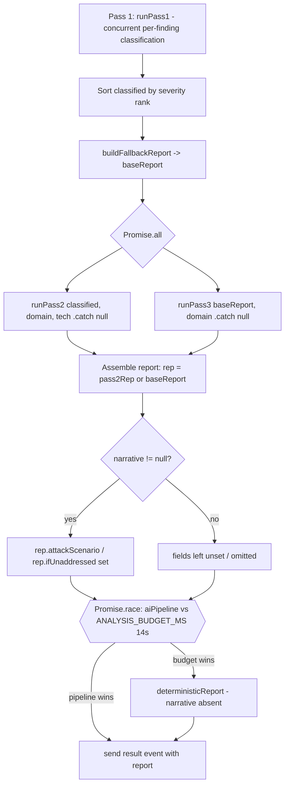

# Design Document

## Overview

Pass 3 (Exploit Narrative) is the narrative layer of the multi-pass AI domain
security analysis pipeline. It is implemented by the `runPass3` function and the
`PASS3_SYSTEM` prompt constant in `netlify/functions/lib/analysis.js`, and it is
orchestrated by the `aiPipeline` closure inside the streaming handler in
`netlify/functions/scan.js`.

Pass 3 takes a deterministic **base report** (the score, risk level, and
severity-sorted findings produced from Pass 1's classified output), distills it
into a small, well-defined payload of only real (scored) findings, and asks the
LLM to write two short plain-English narrative fields for a non-technical
business owner:

- `attackScenario` — a hypothetical, illustrative description of how the existing
  findings could be chained together by an attacker.
- `ifUnaddressed` — a speculative description of how risk could compound over
  time if the top findings are left unfixed.

Pass 3 either returns an object `{ attackScenario, ifUnaddressed }` (both
whitespace-trimmed strings, at least one non-empty) or `null`. On `null`, the
orchestration omits the two narrative fields from the final report entirely so
the frontend simply does not render those sections.

This document describes the **existing, working implementation as-is**. It does
not propose changes. Where the code carries a stale comment ("after Pass 2") or
where the README suggests different field names (`scenario`/`trajectory`), this
document records the actual behavior and flags the discrepancy as a known,
accepted state rather than a defect to fix.

### Goals

- Accurately document how Pass 3 fits into the concurrent Pass 2 / Pass 3
  orchestration and the analysis budget race in `scan.js`.
- Specify the exact payload and output data shapes Pass 3 depends on and produces.
- Capture the failure/`null` contract and how the orchestration integrates (or
  omits) the narrative.
- Record the known gaps (prompt-only enforcement of "no invented
  vulnerabilities"; no automated narrative-vs-findings cross-check; stale
  comment) as accepted limitations.

### Non-Goals

- Changing or improving Pass 3's behavior, prompt, or contract.
- Documenting the certificate-history timeline, which is built in `checks.js`
  and is explicitly out of scope (Requirement 9).
- Documenting Pass 1 or Pass 2 beyond what is necessary to explain Pass 3's
  inputs and concurrency.

## Architecture

### Pipeline position

The AI analysis runs inside the streaming Netlify handler (`scan.js`) after the
passive checks complete. The `aiPipeline` async closure performs:

1. **Pass 1** — classify each finding independently and concurrently
   (`runPass1`). On total failure it falls back to deterministic classification.
2. **Base report construction** — sort Pass 1's classified findings in
   descending severity rank and build the deterministic `baseReport` via
   `buildFallbackReport(domain, sortedClassified)`.
3. **Pass 2 + Pass 3 concurrently** — a single `Promise.all` initiates both
   `runPass2(...)` and `runPass3(baseReport, domain)`. Each is individually
   guarded with `.catch(() => null)`.
4. **Report assembly** — the Pass 2 report (or the base report if Pass 2 failed)
   becomes the report; provider, domain, and tech stack are attached; and if the
   Pass 3 narrative is non-null, its two fields are copied onto the report.

The whole `aiPipeline` is then raced against a fixed `ANALYSIS_BUDGET_MS`
(14000 ms) timer. Whichever settles first wins: if the pipeline finishes in
time its report is emitted; otherwise the instant deterministic report is
shipped so the scan never hangs.



### Key architectural facts

- **Concurrency (Requirement 1).** Pass 2 and Pass 3 are both started inside one
  `Promise.all([...])`; Pass 3 is not preceded by any `await` on Pass 2. A code
  comment near the call describes Pass 3 as running "after Pass 2" — that comment
  is **stale**; the authoritative behavior is concurrent execution.
- **Input independence (Requirement 2).** Pass 3 receives `baseReport`, derived
  solely from Pass 1's classified findings via `buildFallbackReport`. Pass 2's
  prose/output is never passed into Pass 3. Even if Pass 2 fails, Pass 3 still
  receives the unchanged `baseReport`.
- **Isolated failure (Requirements 1.4, 1.5).** Each pass has its own
  `.catch(() => null)`, so one failing does not abort the other or the pipeline.
- **Budget race (cross-cutting).** Pass 3's own 10 s LLM timeout sits inside the
  larger 14 s analysis budget. If the budget expires first, the deterministic
  report (which never carries narrative fields) is emitted; the still-running
  pipeline's later `send` calls hit a closed stream and are harmlessly ignored.

### Out of scope (Requirement 9)

The certificate-history timeline is constructed in `checks.js` and rendered in a
distinct report section. It is never part of Pass 3's payload and never
influences Pass 3's output.

## Components and Interfaces

### `runPass3(report, domain)` — `netlify/functions/lib/analysis.js`

The single entry point for Pass 3.

- **Parameters:**
  - `report` — the deterministic `baseReport`. Pass 3 reads `report.findings`
    (array), `report.riskLevel`, and `report.overallRiskScore`.
  - `domain` — the domain string, embedded into the user message and the payload.
- **Returns:** `Promise<{ attackScenario: string, ifUnaddressed: string } | null>`.
- **Behavior:**
  1. Filter `report.findings` to **scored findings**: keep a finding only when
     `f.severity !== "info"` AND `!f.informational`.
  2. Compute `hasRealFindings = scored.length > 0` and
     `cleanScan = !hasRealFindings`.
  3. Build the payload (see Data Models) and call `callLLMJson` once with
     `PASS3_SYSTEM`, `maxTokens: 700`, `temperature: 0.4`, `timeoutMs: 10000`.
  4. Trim `attackScenario` and `ifUnaddressed`, coercing absent/non-string values
     to `""`.
  5. If both are empty after trim, return `null`; otherwise return the two-field
     object.
  6. On any thrown error (including timeout and parse failure after retry),
     return `null` from the `catch`.

### `PASS3_SYSTEM` — prompt constant

The system prompt that encodes Pass 3's behavioral contract for the LLM. It is
the **only** mechanism enforcing the no-invented-vulnerabilities rule
(Requirement 5). Relevant clauses:

- Exact output shape `{ "attackScenario": string, "ifUnaddressed": string }`.
- "Use ONLY the findings provided. NEVER invent, assume, or imply a vulnerability
  that is not in the findings list."
- For clean scans (no real findings): produce a short positive note explaining
  why the public attack surface looks low, instead of fabricating an attack.
- `attackScenario`: 3–5 sentences framed explicitly as hypothetical/illustrative,
  non-alarmist.
- `ifUnaddressed`: 2–3 speculative sentences, no specific timeframe or certainty.

There is **no code that validates the returned narrative text against the
findings list**. The constraint lives entirely in the prompt. This is a known,
accepted limitation (Requirements 5.2–5.4).

### `callLLMJson(opts)` — `netlify/functions/lib/llm.js`

The dependency Pass 3 uses to talk to the model.

- Calls the chat-completions endpoint in JSON mode and parses the response via
  `extractJson`.
- **Single retry:** on a first-attempt failure (network/parse), it retries once
  with a stricter "return ONLY raw JSON" system suffix, still in JSON mode. If the
  second attempt's parse also throws, the error propagates to the caller — Pass 3
  catches it and returns `null`.
- **Timeout:** `timeoutMs` (10000 for Pass 3) drives an `AbortController`; an
  aborted request rejects, which Pass 3 treats as a `null` outcome.

### `aiPipeline` orchestration — `netlify/functions/scan.js`

The closure that builds `baseReport`, runs `runPass2`/`runPass3` concurrently,
assembles the report, and conditionally copies the narrative:

```js
if (narrative) {
  rep.attackScenario = narrative.attackScenario;
  rep.ifUnaddressed = narrative.ifUnaddressed;
}
```

When `narrative` is `null`, neither field is assigned — they are absent own
properties on the report, never set to `null` or a placeholder (Requirement 8).

## Data Models

### Pass 3 input: base report (consumed fields)

Pass 3 only reads three fields from the `baseReport`:

| Field              | Type     | Use                                              |
| ------------------ | -------- | ------------------------------------------------ |
| `findings`         | array    | Source for the scored-finding filter             |
| `riskLevel`        | string   | Becomes payload `overallRiskLevel`               |
| `overallRiskScore` | number   | Becomes payload `overallRiskScore`               |

Each finding object may carry `title`, `severity`, `explanation`,
`informational` (and other fields Pass 3 ignores).

### Scored finding filter

A finding is **included** in the payload if and only if:

```
severity !== "info"  AND  informational is falsy
```

Equivalently, a finding is **excluded** iff `severity === "info"` OR
`informational` is truthy (Requirement 3.2).

### Pass 3 payload (sent to the LLM)

Exactly five top-level fields, serialized as JSON with 2-space indentation inside
a user message that also names the domain (Requirements 3.1, 3.7):

```json
{
  "domain": "example.com",
  "overallRiskLevel": "Medium",
  "overallRiskScore": 32,
  "cleanScan": false,
  "findings": [
    { "title": "Missing DMARC record", "severity": "high", "explanation": "..." }
  ]
}
```

- `cleanScan` is `true` when `findings` is empty after filtering, else `false`
  (Requirements 3.5, 6.1, 6.2).
- When every finding is excluded, `findings` is `[]` and `cleanScan` is `true`
  (Requirement 3.6).
- Each mapped finding has exactly `title`, `severity`, `explanation` — no other
  fields (Requirement 3.3).

### Pass 3 output

```ts
type Pass3Result =
  | { attackScenario: string; ifUnaddressed: string }  // both trimmed; >= 1 non-empty
  | null;                                                // both empty, or failure
```

- Both fields are trimmed; absent/non-string raw values become `""`
  (Requirements 4.2, 4.3).
- If both are empty after trim → `null` (Requirement 4.4).
- Field names are exactly `attackScenario` and `ifUnaddressed` — never
  `scenario`/`trajectory` (Requirement 4.5).

### Final report integration

| Pass 3 result | `report.attackScenario` | `report.ifUnaddressed` |
| ------------- | ----------------------- | ---------------------- |
| object        | set from result          | set from result        |
| `null`        | absent (own property)    | absent (own property)  |

## Correctness Properties

*A property is a characteristic or behavior that should hold true across all
valid executions of a system — essentially, a formal statement about what the
system should do. Properties serve as the bridge between human-readable
specifications and machine-verifiable correctness guarantees.*

Pass 3's LLM call is an I/O boundary and is not itself property-tested. However,
the logic **around** the call — payload construction (filtering, mapping,
`cleanScan`), output normalization (trim, coercion, null contract, stable field
names), and the orchestration's integration/omission of the narrative — is pure,
input-driven logic with universal invariants. These are tested by stubbing
`callLLMJson` so iterations run fully in memory.

### Property 1: Payload includes exactly the five top-level fields

*For any* base report and domain, the payload Pass 3 builds SHALL have exactly
the top-level keys `domain`, `overallRiskLevel`, `overallRiskScore`, `cleanScan`,
and `findings`, and no others.

**Validates: Requirements 3.1**

### Property 2: Payload findings are exactly the scored findings, correctly mapped

*For any* base report whose `findings` is an arbitrary mix of scored and
excluded findings (varying `severity`, including `"info"`/mixed case, and varying
`informational` flags), the payload `findings` array SHALL contain one entry for
each finding with `severity !== "info"` AND falsy `informational` and no others,
preserving order, where each entry has exactly the keys `title`, `severity`,
`explanation`.

**Validates: Requirements 3.2, 3.3, 3.6**

### Property 3: cleanScan reflects the absence of scored findings

*For any* base report, the payload's `cleanScan` SHALL be `true` if and only if
the filtered scored-findings list is empty (i.e. equals `payload.findings.length
=== 0`).

**Validates: Requirements 3.5, 6.1, 6.2**

### Property 4: Risk fields are copied from the base report

*For any* base report, the payload's `overallRiskLevel` SHALL equal the report's
`riskLevel` and the payload's `overallRiskScore` SHALL equal the report's
`overallRiskScore`.

**Validates: Requirements 3.4**

### Property 5: Output shape and null contract

*For any* LLM JSON response, after Pass 3 trims `attackScenario` and
`ifUnaddressed` (coercing absent or non-string values to `""`): if both are empty
the result SHALL be `null`; otherwise the result SHALL be an object with exactly
the keys `attackScenario` and `ifUnaddressed`, both strings with no leading or
trailing whitespace.

**Validates: Requirements 4.1, 4.2, 4.3, 4.4, 7.4, 7.6**

### Property 6: Failure always yields null, never a fabricated narrative

*For any* failure mode of the LLM call (thrown error, timeout/abort, or parse
failure after the single retry), Pass 3 SHALL return `null` and SHALL NOT produce
any deterministic fallback narrative text.

**Validates: Requirements 7.1, 7.2, 7.3, 7.5, 6.6, 6.7**

### Property 7: Field names are stable

*For any* successful run, the returned object SHALL use exactly the keys
`attackScenario` and `ifUnaddressed` and SHALL NOT contain keys `scenario` or
`trajectory`.

**Validates: Requirements 4.5**

### Property 8: Integration omits narrative fields exactly when result is null

*For any* Pass 3 result, the report-assembly step SHALL set both
`attackScenario` and `ifUnaddressed` as own properties when the result is a
non-null object, and SHALL leave both as absent own properties (never `null`,
empty, or placeholder) when the result is `null`.

**Validates: Requirements 8.1, 8.2, 8.3, 8.4, 7.7**

## Error Handling

Pass 3 is designed to **degrade to omission**, never to a fabricated or templated
narrative. All failure paths converge on a single outcome: `runPass3` returns
`null`.

| Failure mode | Mechanism | Result |
| ------------ | --------- | ------ |
| LLM throws (network, HTTP error) | `try/catch` in `runPass3` | `null` |
| Timeout (10 s) | `AbortController` in `callLLM` rejects | `null` |
| Parse failure after one retry | `extractJson` throws on 2nd attempt | `null` |
| Both fields empty after trim | explicit `if (!attackScenario && !ifUnaddressed)` | `null` |
| Pass 3 rejects unexpectedly | `.catch(() => null)` in `scan.js` `Promise.all` | `null` |
| Analysis budget (14 s) expires first | `Promise.race` ships deterministic report | narrative absent |

Key contrasts and accepted gaps:

- **No deterministic fallback (vs Pass 2).** Pass 2 builds a deterministic
  fallback report on failure; Pass 3 deliberately has only two outcomes —
  non-null object or `null` (Requirement 7.5).
- **Pass 3 always calls the LLM (vs Pass 2's hard-skip).** Even on a clean scan
  (`cleanScan: true`), Pass 3 invokes the LLM exactly once to obtain a positive
  note; Pass 2 hard-skips the LLM on zero findings (Requirements 6.3, 6.4).
- **Prompt-only enforcement of "no invented vulnerabilities".** Enforced solely
  through `PASS3_SYSTEM`; there is no code that cross-checks the narrative text
  against the findings list. This is a **known, accepted limitation**, not a
  defect to silently fix (Requirements 5.2–5.4).
- **Isolated failures.** A Pass 3 failure never aborts Pass 2 or the pipeline,
  and vice versa, because of the per-pass `.catch(() => null)`.

## Testing Strategy

Pass 3 is well-suited to a **dual testing approach**. The pure logic around the
LLM call has clear universal invariants (filtering, mapping, `cleanScan`, output
normalization, null contract, integration), which are best covered by
property-based tests. The LLM call itself is an external I/O boundary and is
covered by example/integration-style tests with a stubbed client.

The repository already uses **vitest** with **fast-check**; Pass 3 tests follow
the same conventions (see `scan-engine.property3.test.js`).

### Property-based tests

- Use `fast-check` with a **minimum of 100 iterations** per property (matching the
  existing suite's `numRuns`).
- Stub `callLLMJson` so the model boundary is deterministic and in-memory:
  - For payload properties (1–4): capture the arguments passed to the stub and
    assert on the serialized payload, while feeding generated base reports
    (arbitrary findings with varied `severity`, including `"info"` and mixed
    case, and varied `informational` flags).
  - For output properties (5–7): make the stub return generated JSON objects
    (fields present/absent, string/non-string, whitespace-only, empty) and assert
    the trim/coercion/null contract and stable key names.
  - For failure (Property 6): make the stub throw / reject (including an
    abort-style rejection) and assert `null`.
- Tag each property test with a comment referencing its design property, e.g.:
  `// Feature: exploit-narrative, Property 5: Output shape and null contract`.

### Unit / example tests

- A representative clean-scan case: empty scored findings → `cleanScan: true`,
  LLM invoked once.
- A representative multi-finding case verifying severity-ordered findings flow
  through unchanged into the payload mapping.
- Integration-style test of the `scan.js` assembly step: a non-null narrative
  sets both report fields; a `null` narrative leaves both absent (assert via
  `Object.prototype.hasOwnProperty`).

### Out-of-scope verification

A focused check that the certificate-history timeline does not appear in Pass 3's
payload and does not affect its output (Requirement 9) — best expressed as an
example test asserting the payload's five-key shape regardless of timeline data.
