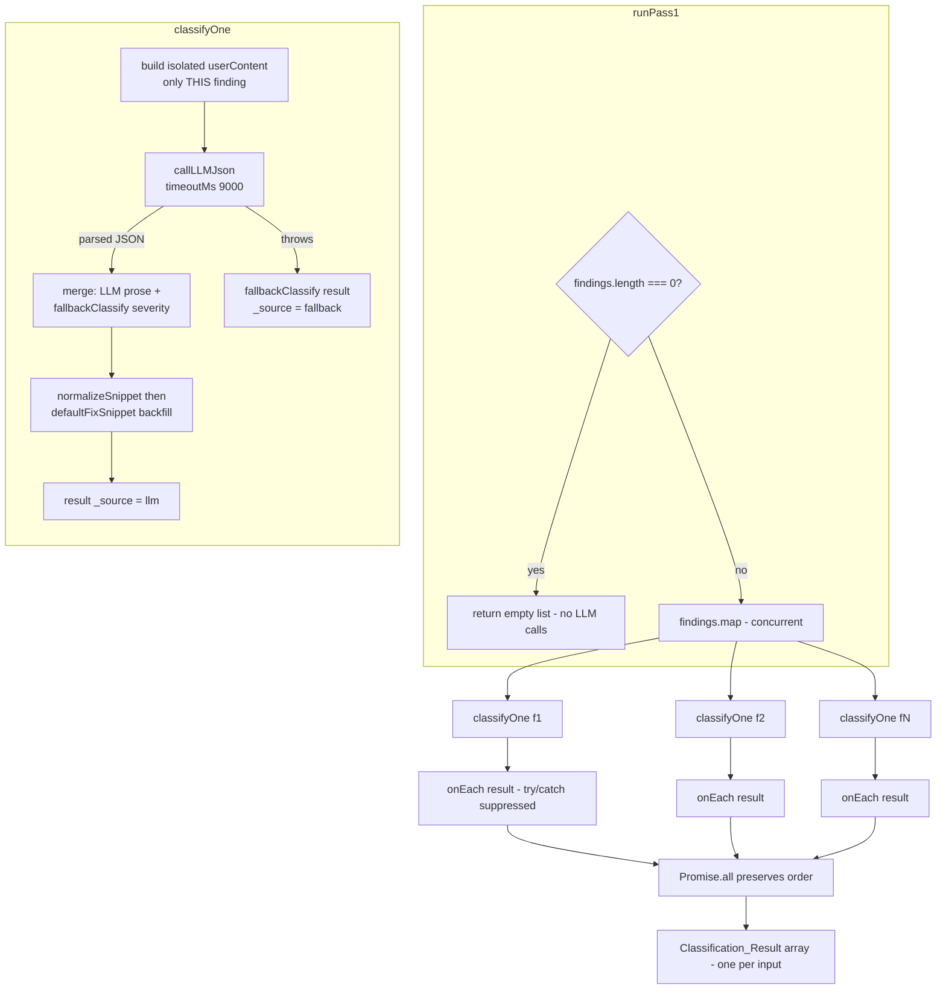
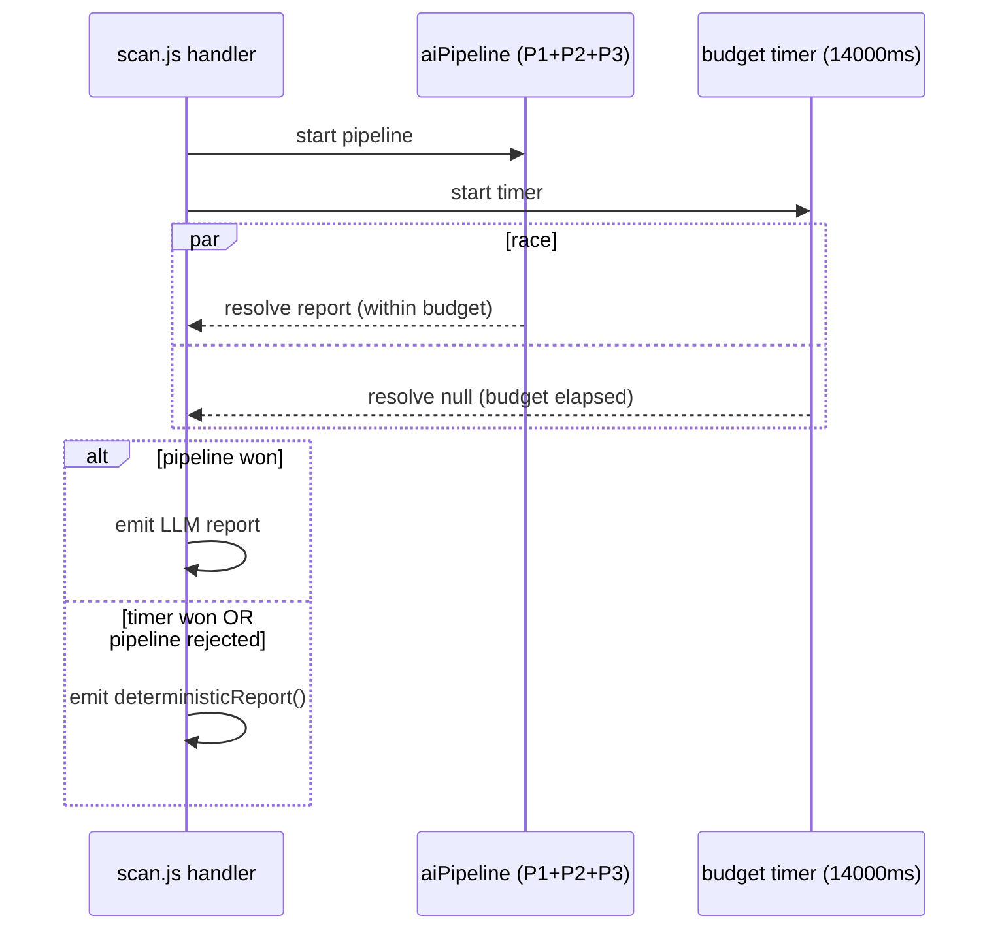

# Design Document

## Overview

This document describes the **as-built** design of **Pass 1** of the multi-pass AI analysis pipeline — the per-finding classification stage implemented in `netlify/functions/lib/analysis.js` (`runPass1`, `classifyOne`, `pass1System`, `normalizeSnippet`), supported by `netlify/functions/lib/findings.js` (`deriveFindings`, `fallbackClassify`, `defaultFixSnippet`, `SEVERITY_MAP`, snippet builders) and `netlify/functions/lib/llm.js` (`callLLMJson`). The overall AI-phase wall-clock budget is enforced by the scan handler in `netlify/functions/scan.js`.

This design documents the observable behavior of working, already-implemented code. It does not propose new behavior or code changes; it captures the contract of the existing system to ground future maintenance and testing.

### Pass 1's role in the pipeline

The scan handler runs a passive-check engine that produces a raw `scanResult`. `deriveFindings(scanResult)` flattens that raw observation into a list of discrete, single-issue **Findings** (one per problem: a missing SPF record, an expiring TLS cert, an exposed `.git/config`, etc.), and also returns the confidently-matched `provider` and the informational `techStack`.

Pass 1 is the **first AI stage**. It takes that list of Findings and produces, for each one, a **Classification_Result**: human-readable prose (`title`, `explanation`, `recommendation`, `fixSnippet`) plus a **deterministically-assigned `severity`**. Each finding is scored *in isolation* by a single LLM call, and degrades gracefully to a deterministic rule-based classification whenever the LLM is unavailable, slow, or returns unparseable output.

Pass 1 sits between:

- **Upstream — `deriveFindings` (input):** supplies the Findings, `provider`, and `techStack`. Pass 1 never re-derives findings; it only classifies what it is given.
- **Downstream — Pass 2 / Pass 3:** Pass 2 (`runPass2`) synthesizes an executive narrative and computes the deterministic overall risk score/level from Pass 1's (rule-based) severities. Pass 3 (`runPass3`) writes an attacker's-eye narrative grounded only in the classified findings. Both consume Pass 1's `Classification_Result[]`.

```mermaid
flowchart LR
    RAW[scanResult<br/>raw passive observations] --> DF[deriveFindings]
    DF -->|findings[]| P1[runPass1<br/>Pass 1 classifier]
    DF -->|provider| P1
    DF -->|techStack| P1
    P1 -->|Classification_Result[]| P2[runPass2<br/>executive synthesis]
    P1 -->|Classification_Result[]| P3[runPass3<br/>attacker narrative]
    P2 --> REP[Final report]
    P3 --> REP
```

Pass 1's design priorities, in order: **isolation** (no cross-finding contamination), **deterministic severity** (stable badges/scores across repeat scans), **graceful degradation** (a complete report regardless of LLM health), and **bounded latency** (no single finding or model stall can hang the report).

## Architecture

### Component responsibilities

| Component | File | Responsibility |
|---|---|---|
| `runPass1(findings, provider, tech, onEach)` | `analysis.js` | Fan-out orchestrator. Dispatches one `classifyOne` per finding concurrently via `Promise.all`, invokes the optional `onEach` streaming callback, preserves input order, short-circuits on empty input. |
| `classifyOne(finding, provider, tech)` | `analysis.js` | Classifies a single finding. Builds isolated user content, makes the bounded LLM call, merges LLM prose with deterministic severity, normalizes `fixSnippet`, and falls back per-finding on any error. |
| `pass1System(provider, tech)` | `analysis.js` | Builds the system prompt, conditionally injecting provider and tech-stack context. |
| `normalizeSnippet(s)` | `analysis.js` | Reduces an LLM `fixSnippet` to a clean literal or `null`. |
| `callLLMJson(opts)` | `llm.js` | Single LLM round-trip expecting JSON, with one parse-failure retry under a per-call `AbortController` timeout. |
| `fallbackClassify(finding)` | `findings.js` | Deterministic rule-based classification: severity from `SEVERITY_MAP` (by `id`, then `type`, then `low`) plus default prose and snippet. |
| `defaultFixSnippet(finding)` | `findings.js` | Backfills a `fixSnippet`: `suggestedSnippet` → per-type literal default → `null`. |
| `scan.js` handler | `scan.js` | Enforces the 14000 ms AI-phase budget via `Promise.race` against the AI pipeline; ships the deterministic report on timeout/failure. |

### Data flow



### Concurrency model

`runPass1` issues **one LLM call per finding, all dispatched concurrently** through `Promise.all(findings.map(async f => ...))`. Total pass latency is therefore bounded by the *slowest* finding rather than the *sum* of all findings.

**Why one-call-per-finding-concurrent rather than batching:** LLM output is **token-bound** — the model must generate prose for every finding sequentially within a single response. A single batched call that classifies all N findings has to emit all N findings' worth of prose in one serialized generation, which is slower end-to-end than N small concurrent calls that each generate only one finding's prose in parallel. Batching was tried and measured slower, so the implementation deliberately fans out. The code comment in `analysis.js` records this: *"LLM output is token-bound, so N small concurrent calls finish faster than one big batched call that has to generate all the prose sequentially."*

A secondary benefit of fan-out is **fault isolation**: each call degrades to its own deterministic rule on failure (see Error Handling), so one bad finding never sinks the others. (Requirements 2.1, 2.2)

### Streaming callback path

`runPass1` accepts an optional `onEach` callback. As each `classifyOne` settles, `onEach(result)` is invoked exactly once for that finding, wrapped in a `try { onEach(result) } catch (_) {}` so a throwing callback is suppressed and never aborts the pass. If `onEach` is not a function (including when omitted), no callback is invoked. The streaming scan path in `scan.js` uses this to emit a `pass1`/`tick` progress event per completed finding to the UI. (Requirement 10)

## Components and Interfaces

### `runPass1(findings, provider, tech, onEach) → Promise<Classification_Result[]>`

- **`findings`**: `Finding[]` from `deriveFindings`.
- **`provider`**: `string | null` — confidently-matched DNS/hosting provider, or `null`.
- **`tech`**: `Tech_Stack | undefined` — detected technology context.
- **`onEach`**: `((result) => void) | undefined` — optional per-finding completion callback.
- **Returns**: array of `Classification_Result`, one per input finding, **in input order**.
- **Empty input**: returns `[]` immediately, issuing no LLM calls and invoking no callback.

### `classifyOne(finding, provider, tech) → Promise<Classification_Result>`

Builds the isolated user content for the single finding, calls `callLLMJson` with `maxTokens: 600`, `temperature: 0`, `timeoutMs: 9000`, then merges the LLM prose with the deterministic severity from `fallbackClassify(finding)`. On any thrown error it returns the deterministic result with `_source: "fallback"`. Never rejects in normal operation — the `try/catch` converts failure into fallback.

### `pass1System(provider, tech) → string`

Builds the system prompt as an array of lines joined by `\n`, filtering out `null` lines. Conditionally injects a provider line and a tech-stack line (see Prompt Construction).

### `callLLMJson(opts) → Promise<object>`

Performs one JSON-mode LLM call; on a parse failure it retries exactly once with a stricter JSON-only system suffix. Each underlying `callLLM` invocation runs under an `AbortController` whose timer fires at `timeoutMs` (9000 ms for Pass 1). Throws if both attempts fail to parse or time out — the caller (`classifyOne`) decides the fallback.

## Data Models

### Finding (input — produced by `deriveFindings`)

```js
{
  id: string,                 // stable for fixed findings ("spf-missing"); dynamic for
                              // exposure ("exposed-file-/.env") and subdomain ("subdomain-dev")
  type: string,              // category: "email-auth" | "tls" | "header" | "subdomain"
                              //          | "dns" | "cookie" | "mixed-content"
                              //          | "info-leak" | "exposure"
  label: string,             // short human-readable issue name
  detail: string,            // longer description; for record findings, embeds the literal value
  suggestedSnippet?: string, // pre-computed paste-ready record value (SPF/DMARC/CAA only)
  path?: string              // present on exposure findings (the probed path)
}
```

### Classification_Result (output)

```js
{
  id: string,            // === finding.id, unchanged
  type: string,          // === finding.type, unchanged
  title: string,         // LLM title, or finding.label if LLM omitted/empty
  severity: "critical" | "high" | "medium" | "low",  // ALWAYS deterministic
  explanation: string,   // LLM prose, or fallback explanation if omitted/empty
  recommendation: string,// LLM prose, or fallback recommendation if omitted/empty
  fixSnippet: string | null, // clean literal or null (never prose)
  _source: "llm" | "fallback"
}
```

### Provider

`string | null`. Set only by `inferProvider` via a verified nameserver-pattern lookup. A non-null value is treated as confidently matched and may be named in remediation; `null` forces generic, provider-agnostic guidance.

### Tech_Stack

```js
{ server: string | null, poweredBy: string | null, detected: string[] }
```

Remediation **context only**. Never a vulnerability, never assigned a severity, never affecting risk score. Only `detected` (when non-empty) influences Pass 1 — it produces the optional tech-context prompt line.

### suggestedSnippet vs fixSnippet

- **`suggestedSnippet`** (on the input Finding): the domain-specific, pre-computed correct record value built by `deriveFindings` for SPF (`buildSpfSuggestion`), DMARC (`buildDmarcSuggestion`), and CAA (`buildCaaSuggestion`). Paste-ready and literal.
- **`fixSnippet`** (on the output Classification_Result): the paste-ready literal value surfaced in the report, or `null`. Resolved as `normalizeSnippet(json.fixSnippet) || defaultFixSnippet(finding)`.

### Severity model (deterministic only)

Severity is **always** the value returned by `fallbackClassify`, never the LLM's judgment. `fallbackClassify` resolves severity as:

1. `SEVERITY_MAP[finding.id]` — exact-id lookup for fixed findings.
2. For dynamic-id findings: `type === "exposure"` → per-path `EXPOSED_FILE_INFO` severity (default `high`); `type === "subdomain"` → `medium`.
3. Default `low` when nothing matches.

Because the inputs (`id`, `type`, `path`) are deterministic, the assigned severity is byte-identical across repeat scans. The LLM is explicitly instructed *not* to assign a severity. (Requirements 3.1–3.5)

### fixSnippet normalization and backfill chain

`classifyOne` resolves `fixSnippet` as:

```js
fixSnippet: normalizeSnippet(json.fixSnippet) || defaultFixSnippet(finding)
```

- **`normalizeSnippet(s)`**: returns `null` if `s` is falsy, not a string, empty/whitespace-only after trimming, or equals `"null"` (case-insensitive after trim); otherwise returns the trimmed value. This converts an unusable LLM snippet to `null` so the `||` falls through to the backfill.
- **`defaultFixSnippet(finding)`**: returns `finding.suggestedSnippet` first, then the per-`id` literal from `FIX_SNIPPETS` (SPF/DMARC/CAA), then `null`.

Net result: `fixSnippet` is always either a clean, trimmed literal value or `null` — never prose, never whitespace, never the string `"null"`. (Requirements 6.3–6.6)

## Prompt Construction

### System prompt (`pass1System`)

The system prompt is assembled as an array of lines (`null` lines filtered out, joined by `\n`). Its fixed core instructs the model to:

- Score exactly **one** finding **in isolation** and not assume the presence/absence of other issues. (Requirements 1.2, 1.1)
- Return **only** a JSON object of shape `{ title, explanation, recommendation, fixSnippet }`. (Requirement 3.4)
- **Not assign a severity** — severity is a separate deterministic rule. (Requirement 3.4)
- Keep `explanation` to 1–2 plain-English sentences, make `recommendation` specific/actionable, and — for email-authentication (SPF/DMARC) and CAA findings — embed the **exact literal record value inline** in the recommendation. (Requirement 6.1)
- Put a single paste-ready literal in `fixSnippet` only when the fix is one copy-pasteable value, else `null`; never prose. (Requirements 6.2, 6.3)

Two lines are **conditionally injected**:

- **Provider line** — depends on `provider`:
  - Non-null: states the provider was *confidently identified from a verified nameserver-pattern lookup* and that the fix **MAY** be tailored to that provider's dashboard/workflow. (Requirement 4.1)
  - Null: instructs the model to give **generic, provider-agnostic** instructions and to **not name or guess** any provider/platform/registrar. (Requirement 4.2)
  - A fixed follow-up line forbids the model from inferring or naming a provider on its own under any circumstance. (Requirement 4.3)
- **Tech-stack line (`techLine`)** — included only when `tech.detected` exists and is non-empty: lists the detected technologies comma-joined and frames them as **optional** remediation guidance to apply only when confidently relevant. When `tech` is absent, `tech.detected` is absent, or empty, the line is `null` and filtered out entirely. (Requirements 5.1–5.4)

### User content (`classifyOne`)

The user content contains **only the single finding being scored** — its `label` (Issue), `detail` (Details), `type` (Category), and, when present, that finding's own `suggestedSnippet` as a "Pre-computed correct record value ... use this verbatim". No other finding's data is ever referenced, guaranteeing isolation and no cross-finding leakage. (Requirements 1.3, 6.2)

## Concurrency, Timeout, and Budget Model

### Per-call timeout and retry (`callLLMJson` + `classifyOne`)

- Each Pass 1 attempt runs with `timeoutMs: 9000`. `callLLM` arms an `AbortController` (`setTimeout(() => controller.abort(), timeoutMs)`) and aborts the in-flight fetch on expiry. (Requirements 7.1, 7.2)
- `callLLMJson` makes attempt 1 in JSON mode; if parsing fails it retries **exactly once** with a stricter JSON-only system suffix. (Requirement 7.3)
- If both the initial attempt and the single retry fail (parse error or timeout), `callLLMJson` throws — bounding a single finding at **~18000 ms** (9000 ms × 2). (Requirement 7.4)
- `classifyOne` catches that error and returns the deterministic fallback, so the pass continues. (Requirements 7.5, 9.1)

### Overall AI-phase budget (`scan.js`)

The combined AI phase (Pass 1 + Pass 2 + Pass 3, run concurrently within `aiPipeline`) is bounded by `ANALYSIS_BUDGET_MS = 14000` ms. The handler races the pipeline against a budget timer:

```js
const report =
  (await Promise.race([ aiPipeline.then(clearTimer), budget ])) || deterministicReport();
```

- If the pipeline resolves within budget, its LLM report is emitted. (Requirement 8.2)
- If the budget timer wins, `budget` resolves `null`, the `|| deterministicReport()` ships the instant rule-based report, and any later AI output hits a closed stream and is harmlessly ignored. (Requirements 8.1, 8.3)
- If the pipeline rejects before the budget elapses, the rejection handler returns `null`, again falling through to the deterministic report. (Requirement 8.4)



## Error Handling

Pass 1 degrades gracefully at **three independent levels**, so a complete report always renders:

1. **Per-finding (`classifyOne` catch):** any failure for one finding — 9000 ms timeout, JSON parse failure after the single retry, or any other exception — is caught and converted to that finding's deterministic result: `{ ...fallbackClassify(finding), type: finding.type, _source: "fallback" }`. Every other finding is unaffected. (Requirements 1.5, 7.5, 9.1, 9.4)
2. **Whole-pass (`analyze` / `scan.js` catch):** if `runPass1` itself throws entirely, the orchestration classifies *all* findings through `fallbackClassify` with `_source: "fallback"`. (Requirement 9.3)
3. **Phase-budget (`scan.js` `Promise.race`):** if the whole AI phase exceeds 14000 ms or rejects, the handler ships the precomputed `deterministicReport()`. (Requirements 8.3, 8.4)

Prose backfill within an LLM-sourced result is also defensive: a missing/empty `title` falls back to `finding.label`, and a missing/empty `explanation`/`recommendation` falls back to the deterministic rule's text. (Requirements 12.5–12.7)


## Correctness Properties

*A property is a characteristic or behavior that should hold true across all valid executions of a system — essentially, a formal statement about what the system should do. Properties serve as the bridge between human-readable specifications and machine-verifiable correctness guarantees.*

Pass 1 is well suited to property-based testing: it is a near-pure transformation from a list of Findings to a list of Classification_Results, with a large, structured input space (finding types, ids, prose, snippets, provider/tech context) and clear universal invariants. The properties below are derived from the prework analysis, consolidated to remove redundancy. The LLM is replaced by a controllable test double so behavior is deterministic and 100+ iterations are cheap.

### Property 1: Exactly one isolated LLM call per finding

*For any* non-empty list of N findings, `runPass1` issues exactly N LLM calls, and each call's content references the data of exactly one finding and no other finding's `label`, `detail`, `type`, or `suggestedSnippet`.

**Validates: Requirements 1.1, 1.3, 2.1, 2.2**

### Property 2: Output is positionally aligned and identity-preserving

*For any* list of findings (with arbitrary per-call completion ordering), `runPass1` returns a list of the same length where, for every index `i`, `result[i].id === findings[i].id` and `result[i].type === findings[i].type`, regardless of whether each result came from the LLM or the fallback.

**Validates: Requirements 2.3, 9.2, 12.1, 12.2**

### Property 3: Severity is always the deterministic rule value

*For any* finding and *for any* LLM output (including one that supplies a conflicting or bogus severity), `result.severity === fallbackClassify(finding).severity`; classifying the same finding repeatedly yields a byte-identical severity, and supplying or omitting tech-stack context never changes it.

**Validates: Requirements 3.1, 3.2, 3.3, 5.4, 3.5**

### Property 4: Per-finding failure degrades to a deterministic fallback in isolation

*For any* list of findings where an arbitrary subset of LLM calls fail (timeout, parse failure, or any exception), each failing finding's result equals `fallbackClassify(finding)` with `type` preserved and `_source === "fallback"`, every non-failing finding still yields a result with `_source === "llm"`, and the returned list still has exactly one result per input finding.

**Validates: Requirements 1.5, 2.5, 7.5, 9.1, 9.4, 12.4**

### Property 5: Successful results are marked and backfilled

*For any* LLM-sourced result, `_source === "llm"`, and any empty or missing `title` / `explanation` / `recommendation` is replaced by the finding's `label` / the deterministic explanation / the deterministic recommendation respectively.

**Validates: Requirements 12.3, 12.5, 12.6, 12.7**

### Property 6: fixSnippet is always a clean literal or null

*For any* LLM output, the resulting `fixSnippet` is either `null` or a trimmed, non-empty string that is not the literal `"null"` (case-insensitive); when the LLM value is absent, a non-string, empty, whitespace-only, or `"null"`, the field falls back to `defaultFixSnippet(finding)` (the finding's `suggestedSnippet`, then the per-type literal default, then `null`); and when the LLM value is a usable token surrounded by whitespace, the trimmed token is retained.

**Validates: Requirements 6.3, 6.4, 6.5, 6.6**

### Property 7: Conditional provider and tech-stack prompt injection

*For any* non-null `provider`, `pass1System` includes that provider name with the tailoring clause; *for any* `tech` whose `detected` list is non-empty, the system prompt includes a single comma-joined line containing every detected technology framed as optional guidance; and *for any* `tech` that is absent, lacks `detected`, or has an empty `detected` list, no tech-context line appears.

**Validates: Requirements 4.1, 5.1, 5.3, 5.2**

### Property 8: suggestedSnippet is passed to the model verbatim

*For any* finding carrying a `suggestedSnippet`, the user content built for that finding contains the snippet value verbatim.

**Validates: Requirements 6.2**

### Property 9: onEach is invoked once per finding and is failure-isolated

*For any* non-empty list of findings with a supplied `onEach` callback, the callback is invoked exactly once per finding with that finding's Classification_Result; and *for any* such list where `onEach` always throws, `runPass1` still resolves with exactly one result per input finding without rejecting.

**Validates: Requirements 10.1, 10.2**

## Testing Strategy

### Dual approach

- **Property-based tests** verify the universal invariants above across a wide, generated input space, with the LLM call replaced by a controllable double.
- **Example-based and edge-case unit tests** cover specific scenarios, fixed prompt content, configuration values, and timer-driven behavior that do not vary meaningfully with input.
- **Integration tests** cover the `AbortController`/timeout wiring and the `scan.js` budget race, which involve timers and the fetch boundary rather than input-varying logic.

### Property-based testing

- Use a property-based testing library for JavaScript (e.g. `fast-check`) with a test runner such as Vitest or Jest. Do **not** hand-roll generators/shrinking.
- Each property test runs a **minimum of 100 iterations**.
- Replace `callLLMJson` (or inject the LLM call) with a configurable double so generators can drive returned prose, malformed/empty fields, conflicting severities, and induced failures/timeouts without real network calls — keeping iterations cheap.
- Generators should produce: random finding lists spanning all `type` values and both fixed and dynamic `id` forms (`exposure`, `subdomain`); findings with and without `suggestedSnippet`; randomized per-call resolution order and failure subsets; arbitrary `fixSnippet` strings including whitespace-padded, empty, and `"null"` variants; non-empty and empty/absent `tech.detected`; and null and non-null `provider` values with sentinel substrings to verify isolation/no-leakage.
- Tag each property test with a comment referencing its design property, format:
  **Feature: finding-classification, Property {number}: {property_text}**

### Unit, edge-case, and integration tests

- **Fixed prompt content (examples):** `pass1System` contains the isolation directive, the JSON-shape + "do NOT assign a severity" instruction (Req 1.2, 3.4), the email-auth/CAA inline-literal instruction (Req 6.1), the never-infer-provider line (Req 4.3), the null-provider generic-instruction branch (Req 4.2), and the optional-guidance framing of the tech line (Req 5.2).
- **Empty input (edge cases):** `runPass1([])` returns `[]`, issues no LLM call, invokes `classifyOne` for nothing, and never calls `onEach` (Req 1.4, 2.4, 10.4, 11.1–11.3). `onEach` omitted or a non-function classifies all findings and returns without throwing (Req 10.3).
- **Timeout/retry (examples + integration):** `classifyOne` calls `callLLMJson` with `timeoutMs: 9000` (Req 7.1); a hanging fetch is aborted via `AbortController` after the timeout (Req 7.2, integration with fake timers); unparseable-then-valid output triggers exactly one retry with the stricter suffix (Req 7.3); both attempts failing makes `callLLMJson` throw and `classifyOne` fall back (Req 7.4).
- **Whole-pass failure (example):** forcing `runPass1` to throw makes `analyze` classify all findings via `fallbackClassify` with `_source: "fallback"` (Req 9.3).
- **AI-phase budget (examples + integration, `scan.js`):** with fake timers — pipeline resolving within budget emits the LLM report (Req 8.2); a never-resolving / over-budget pipeline emits the deterministic report and later sends are ignored on the closed stream (Req 8.1, 8.3); a rejecting pipeline before budget emits the deterministic report (Req 8.4).

### Coverage notes

The properties cover all acceptance criteria classified as testable. Criteria that assert fixed prompt wording (1.2, 3.4, 4.2, 4.3, 5.2, 6.1), configuration values (7.1, 8.1), timer/abort wiring (7.2, 8.x), one-shot orchestration failure (9.3), or empty-input boundaries (1.4, 2.4, 10.3, 10.4, 11.1–11.3) are covered by example/edge/integration tests rather than properties, because their behavior does not vary meaningfully with input. Requirement 6.1's *model compliance* (the model actually embedding the literal value) is not deterministically unit-testable; only the prompt instruction is asserted.
