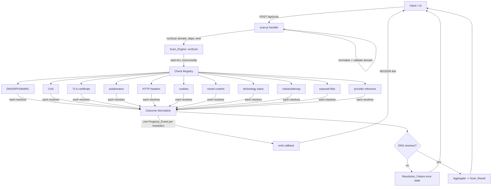
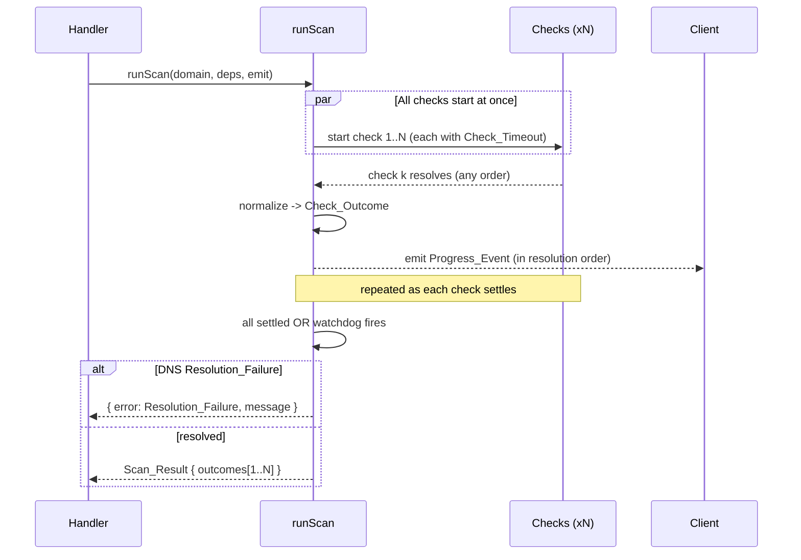

# Design Document

## Overview

The Passive Scan Engine (`Scan_Engine`) orchestrates every no-authentication, observation-only security check against a `Target_Domain`, aggregating each `Check`'s outcome into a single structured `Scan_Result`. It is the engine that powers the streaming `POST /api/scan` Netlify Function.

The engine's contract is built around four hard guarantees:

1. **Concurrency** — every defined check starts at the same time, so total wall-clock time is governed by the slowest check, not the sum of all checks.
2. **Partial-failure isolation** — a check that throws, rejects, or times out is recorded as `Unavailable` and never aborts its siblings or the overall scan.
3. **Bounded completion** — the engine always settles within the largest configured `Check_Timeout` plus a 2-second aggregation allowance, regardless of how slow or unresponsive a third-party source is.
4. **Honest, real-time progress** — exactly one `Progress_Event` is streamed per check, emitted in the actual order in which checks resolve.

This design refactors the orchestration logic currently inlined in `netlify/functions/scan.js` into a dedicated, dependency-injected `Scan_Engine` module (`netlify/functions/lib/scan-engine.js`). Extracting the orchestration from the HTTP/streaming handler makes the concurrency, timeout, status-derivation, and progress-ordering logic a clean, pure-ish target for property-based testing, mirroring the pattern already established by `lib/recheck.js` (pure decision logic + injected I/O deps).

### Design Goals

- Preserve the existing passive-only, status-only, no-credentials guarantees already enforced by `lib/checks.js`.
- Normalize every check into one of three explicit statuses — `Success`, `Empty`, `Unavailable` — replacing the current ad-hoc per-check fallback shapes.
- Make the DNS-resolution gate a first-class, distinct error state rather than an inline `send({ type: "error" })` branch.
- Keep the network primitives in `lib/checks.js` untouched; the engine composes them.

### Key Design Decisions

| Decision | Rationale |
|----------|-----------|
| Extract a `runScan(domain, deps)` orchestrator separate from the HTTP handler | Makes concurrency/timeout/status/progress logic unit- and property-testable without a live network or HTTP server. Mirrors `recheck.js`. |
| Inject all check primitives via a `deps` object | Tests simulate success, empty, error, hang, and timeout entirely in-memory (no real network), as already done in `recheck.property*.test.js`. |
| Represent each outcome as `{ id, status, findings, error }` with a 3-value status enum | Requirement 2.4/2.5 demand a clear distinction between "ran, found things", "ran, found nothing", and "could not run". |
| Drive progress via an injected `emit` callback | The engine stays transport-agnostic; the Netlify handler adapts `emit` to NDJSON `controller.enqueue`. |
| Per-check timeout via the existing `withTimeout` helper, plus a global watchdog | Guarantees bounded completion (Req 2.6) even if a check's own `AbortSignal.timeout` misbehaves. |
| DNS resolution gate evaluated before assembling a `Scan_Result` | A non-resolving domain returns a distinct `Resolution_Failure` error state, not a `Scan_Result` of all-unavailable checks (Req 5). |

## Architecture

The engine sits between the HTTP/streaming handler and the passive check primitives.



### Execution Model

`runScan(domain, deps, emit)` performs these phases:

1. **Launch** — build the check registry and start every check concurrently. Each check is wrapped so that (a) it is bounded by its own `Check_Timeout` and (b) the moment it settles, its result is normalized into a `Check_Outcome` and a `Progress_Event` is emitted via `emit`.
2. **Resolve** — `await` all wrapped checks (using `Promise.all` over the already-failure-tolerant wrappers, so no rejection ever propagates). A global watchdog timer guarantees the whole phase cannot exceed the bounded-completion budget.
3. **Gate** — evaluate DNS resolution. If the domain produced a `Resolution_Failure`, return the distinct error state and stop (no `Scan_Result` is produced).
4. **Aggregate** — assemble the `Scan_Result` containing exactly one `Check_Outcome` per defined check.



### Concurrency & Timeout Strategy

- **Concurrency**: all checks are started synchronously in a single loop before any `await`, so their underlying network operations overlap. This is the existing pattern in `scan.js` (each `checkX(domain)` promise is created before the single `await Promise.all([...])`).
- **Per-check timeout**: each check is wrapped with `withTimeout(checkPromise, checkTimeoutMs, TIMEOUT_SENTINEL)`. The configured timeout is per check, constrained to the inclusive range **6000–8000 ms** (`Check_Timeout`). A timed-out check resolves to the sentinel → normalized to `Unavailable`.
- **Bounded completion**: the global budget is `max(all Check_Timeouts) + 2000 ms`. A watchdog `withTimeout` around the entire resolve phase guarantees the engine settles within budget even in pathological cases (e.g., a check that ignores its own abort). Any check still outstanding when the watchdog fires is treated as `Unavailable`.
- **Failure isolation**: every check wrapper has its own `.catch` → sentinel, so a rejected check never rejects `Promise.all`. The engine never uses bare `Promise.all` over raw check promises.

## Components and Interfaces

### Scan_Engine (`netlify/functions/lib/scan-engine.js`)

The new module. Pure orchestration logic plus injected I/O.

```js
// Status enum — the only three values a check outcome can carry.
export const CHECK_STATUS = {
  SUCCESS: "success",       // ran successfully, >= 1 finding
  EMPTY: "empty",           // ran successfully, 0 findings
  UNAVAILABLE: "unavailable" // could not run / complete (error or timeout)
};

// Distinct top-level result discriminator.
export const RESULT_TYPE = {
  SCAN: "scan",                       // a full Scan_Result
  RESOLUTION_FAILURE: "resolution_failure" // DNS could not resolve the domain
};

// The canonical list of defined checks (Requirement 1.3).
export const CHECK_IDS = [
  "dns", "caa", "tls", "subdomains", "headers", "cookies",
  "mixed-content", "tech", "robots", "exposed-files", "provider"
];

// Per-check timeout budgets (ms), each within [6000, 8000] (Check_Timeout).
export const CHECK_TIMEOUTS; // Record<checkId, number>

// Main orchestrator.
//   domain: normalized Target_Domain (string)
//   deps:   injected check primitives (defaults to real lib/checks.js fns)
//   emit:   (Progress_Event) => void   progress callback (defaults to no-op)
// Returns: Promise<Scan_Result | ResolutionFailure>
export async function runScan(domain, deps = defaultDeps, emit = () => {});
```

**Responsibilities:**
- Own `CHECK_IDS`, `CHECK_TIMEOUTS`, and the registry that maps each id to a runnable closure over `deps`.
- Normalize each check's raw result into a `Check_Outcome` with a `CHECK_STATUS`.
- Emit exactly one `Progress_Event` per check, in resolution order.
- Apply the DNS-resolution gate and produce either a `Scan_Result` or a `ResolutionFailure`.

### Check Registry

A registry maps each `checkId` to:
- `run(domain, deps)` — invokes the underlying primitive(s) from `lib/checks.js`.
- `toFindings(raw)` — a **pure** function that derives the findings array used to decide `Success` vs `Empty`.
- `timeout` — the per-check `Check_Timeout` in ms.

Several checks are derived from the single homepage fetch (`checkHeaders`) — `cookies`, `mixed-content`, and `tech` reuse the already-fetched body/headers, exactly as the current `scan.js` does (`analyzeCookies`, `analyzeMixedContent`, `fingerprintTech`). The registry models these as dependent checks that await the shared `headers` promise rather than issuing new requests, preserving the passive single-fetch behavior.

The "findings-bearing" interpretation per check (used to classify `Success`/`Empty`):

| Check | A "finding" means | `Empty` when |
|-------|-------------------|--------------|
| dns | SPF/DMARC present, or notable records | resolves but nothing notable |
| caa | CAA `present` | `missing` |
| tls | a cert was read | valid cert, nothing noteworthy |
| subdomains | ≥1 discovered subdomain | none discovered |
| headers | any security header present | none present |
| cookies | any cookie missing a flag | no cookies / all flags set |
| mixed-content | ≥1 insecure reference | none / not applicable |
| tech | ≥1 detected technology | none detected |
| robots | sensitive disallows or sitemap present | nothing notable |
| exposed-files | ≥1 path returning 200 | none exposed |
| provider | provider identified | not identified |

> Note: a check that *ran but found nothing* is `Empty`, never `Unavailable`. `Unavailable` is reserved strictly for "could not run/complete" (error or timeout). This is the core distinction in Requirements 2.4/2.5.

### Outcome Normalizer

```js
// Pure. Maps a settled check (or the timeout/error sentinel) to a Check_Outcome.
//   - sentinel/error               -> { id, status: UNAVAILABLE, findings: [], error }
//   - ran, toFindings(raw).len > 0 -> { id, status: SUCCESS,     findings, error: null }
//   - ran, toFindings(raw).len = 0 -> { id, status: EMPTY,       findings: [], error: null }
export function normalizeOutcome(id, settled): Check_Outcome;
```

### Progress Emitter

The engine calls `emit(progressEvent)` exactly once per check, at the moment that check's wrapper settles. The handler adapts this to NDJSON.

```js
// Progress_Event shape emitted by the engine:
{ type: "progress", check: <checkId>, status: <CHECK_STATUS>, seq: <n> }
```

`seq` is a monotonically increasing counter assigned at emission time, so consumers can confirm emission order equals resolution order.

### Paid / Out-of-Scope Source Gating

Checks backed by a paid third-party source requiring an API key (e.g., domain-level breach data / HIBP, referenced today by `scan.js` as `hibp.available = false`) are gated **before** they run:

```js
// In the registry closure for a key-gated check:
run(domain, deps) {
  if (!deps.env.HIBP_API_KEY) return UNAVAILABLE_SENTINEL; // Req 6.1
  return realPaidCheck(domain, deps);                       // Req 6.2 — real observation only
}
```

The engine never substitutes simulated findings for a missing key — a key-gated check with no key is reported `Unavailable` (Req 6.1); with a valid key it runs and reports real observation (Req 6.2, 6.3). API keys are read from injected `deps.env` so tests control configuration without touching `process.env`.

### HTTP/Streaming Handler (`netlify/functions/scan.js`)

The existing handler is refactored to delegate orchestration to `runScan`:

```js
const stream = new ReadableStream({
  async start(controller) {
    const emit = (evt) => controller.enqueue(encoder.encode(JSON.stringify(evt) + "\n"));
    const result = await runScan(domain, defaultDeps, emit);
    if (result.type === RESULT_TYPE.RESOLUTION_FAILURE) {
      emit({ type: "error", message: result.message }); // Req 5
    } else {
      emit({ type: "result", scan: result }); // downstream AI analysis (passes 1–3) continues as today
    }
    controller.close();
  }
});
```

Domain normalization/validation (`normalizeDomain`, `isValidDomain`) and the downstream AI analysis passes (`runPass1/2/3`) remain in the handler and are out of scope for the engine itself.

## Data Models

### Check_Outcome

```ts
interface CheckOutcome {
  id: string;            // one of CHECK_IDS
  status: "success" | "empty" | "unavailable";
  findings: Finding[];   // [] when status is empty or unavailable
  error: string | null;  // human-readable reason when unavailable; null otherwise
  data?: object;         // optional normalized raw observation for the report layer
}
```

### Scan_Result

```ts
interface ScanResult {
  type: "scan";
  domain: string;
  scannedAt: string;            // ISO-8601
  outcomes: CheckOutcome[];     // exactly one per CHECK_IDS entry
}
```

### ResolutionFailure

```ts
interface ResolutionFailure {
  type: "resolution_failure";
  domain: string;
  message: string;              // human-readable, NO stack traces / internals (Req 5.2, 5.3)
}
```

### Progress_Event

```ts
interface ProgressEvent {
  type: "progress";
  check: string;                // one of CHECK_IDS
  status: "success" | "empty" | "unavailable";
  seq: number;                  // monotonic emission order index
}
```

### Internal sentinels

```ts
// Returned by withTimeout / a check's catch — normalized to UNAVAILABLE.
const TIMEOUT_SENTINEL = { __unavailable: true, reason: "timeout" };
const ERROR_SENTINEL   = (msg) => ({ __unavailable: true, reason: msg });
```

## Correctness Properties

*A property is a characteristic or behavior that should hold true across all valid executions of a system — essentially, a formal statement about what the system should do. Properties serve as the bridge between human-readable specifications and machine-verifiable correctness guarantees.*

The engine's orchestration logic is an excellent property-based-testing target: it is deterministic given its injected dependencies, and its guarantees (concurrency, status derivation, failure isolation, bounded time, progress ordering) are universally quantified over arbitrary per-check behaviors. As in the existing `recheck.property*.test.js` suite, every check primitive is injected via `deps`, so no real network is touched and hanging/timeout cases run instantly under fake timers.

### Property 1: All checks start concurrently

*For any* set of defined checks, when `runScan` is invoked, every defined check SHALL have started before any check has resolved (i.e., the engine launches all checks before awaiting any of them).

**Validates: Requirements 1.1**

### Property 2: Result completeness

*For any* assignment of behaviors (success, empty, error, rejection, or timeout) to the defined checks, when the scan resolves to a `Scan_Result`, the set of `Check_Outcome` ids SHALL equal `CHECK_IDS` exactly — one outcome per defined check, with no omissions and no duplicates.

**Validates: Requirements 1.2, 2.3**

### Property 3: Status trichotomy

*For any* raw check result and behavior, the outcome normalizer SHALL assign exactly one status: `Unavailable` when the check errored or timed out; `Success` when the check ran and produced one or more findings; and `Empty` when the check ran and produced zero findings.

**Validates: Requirements 2.4, 2.5**

### Property 4: Partial-failure isolation

*For any* subset of checks designated to fail (throw, reject, hang, or exceed their `Check_Timeout`), the scan SHALL still resolve to a complete `Scan_Result` in which every failing check is `Unavailable` and every non-failing check retains the status implied by its own result.

**Validates: Requirements 2.1, 2.2, 2.3**

### Property 5: Bounded completion time

*For any* assignment of check behaviors, including checks that never resolve, `runScan` SHALL settle within the largest configured `Check_Timeout` plus a 2-second aggregation allowance.

**Validates: Requirements 2.6**

### Property 6: No response bodies retained

*For any* `Scan_Result`, no `Check_Outcome` SHALL retain an HTTP response body — in particular, exposed-file outcomes SHALL carry only status-derived fields (path, status, exposed) and no body/content field anywhere in the result.

**Validates: Requirements 3.1, 3.2**

### Property 7: Progress-event invariants

*For any* scan that resolves to a `Scan_Result`, the engine SHALL emit exactly one `Progress_Event` per defined check (the multiset of event check ids equals `CHECK_IDS`, each once); each event SHALL name a check in `CHECK_IDS` with a status matching that check's final `Check_Outcome`; and events SHALL be emitted in the actual order in which checks resolve, with strictly increasing `seq` values.

**Validates: Requirements 4.1, 4.2, 4.3**

### Property 8: Resolution-failure error state

*For any* dependency configuration in which DNS resolution yields no usable address (and the site is unreachable), `runScan` SHALL return a distinct `Resolution_Failure` error state rather than a `Scan_Result`, carrying a non-empty human-readable message that contains no stack traces or internal error details — even when the underlying DNS dependency throws an `Error` with a populated stack.

**Validates: Requirements 5.1, 5.2, 5.3**

### Property 9: Paid-source key gating

*For any* key-gated check, when no valid API key is configured in `deps.env`, the engine SHALL report that `Check_Outcome` as `Unavailable` without invoking the underlying paid primitive; and when a valid key is configured, the engine SHALL invoke the real primitive and derive the outcome from its returned observation, never substituting engine-fabricated findings.

**Validates: Requirements 6.1, 6.2, 6.3**

## Error Handling

The engine treats failure as an expected, first-class outcome rather than an exception path.

| Failure mode | Handling | Resulting state |
|--------------|----------|-----------------|
| A check throws synchronously | Caught in the check wrapper | That `Check_Outcome` is `Unavailable` with a sanitized `error`; siblings unaffected (Req 2.2) |
| A check returns a rejected promise | `.catch` in the wrapper → error sentinel | `Unavailable` outcome; siblings unaffected (Req 2.2) |
| A check exceeds its `Check_Timeout` | `withTimeout` resolves to the timeout sentinel | `Unavailable` outcome; siblings continue (Req 2.1) |
| A check hangs past the global budget | Global watchdog (`max(Check_Timeout)+2000`) resolves the scan | Outstanding checks reported `Unavailable` (Req 2.6) |
| DNS does not resolve the domain | DNS-resolution gate, evaluated before aggregation | Distinct `Resolution_Failure` with sanitized message (Req 5) |
| A key-gated paid source has no key | Pre-run gate in the registry closure | `Unavailable` outcome; real primitive never called (Req 6.1) |
| Unexpected error in the orchestrator | Outer try/catch around the resolve phase | Scan still returns a complete `Scan_Result` with affected checks `Unavailable` |

**Message sanitization** (Req 5.3): all user-facing messages are drawn from a fixed set of human-readable strings parameterized only by the domain. Raw `Error` objects, `error.stack`, and internal details are never interpolated into messages. The `Resolution_Failure` message follows the friendly pattern already used in `scan.js` (e.g., *"We couldn't find \"{domain}\". Double-check the spelling — it may not exist or may not be publicly resolvable."*).

**No unhandled rejections**: the engine never awaits raw check promises directly; it awaits the failure-tolerant wrappers, mirroring the `withTimeout` + sentinel discipline in `lib/recheck.js`. This guarantees `Promise.all` over the wrappers can never reject.

## Testing Strategy

The engine is well suited to a dual testing approach. Property-based tests cover the universal orchestration guarantees; example/unit tests cover the concrete check registry and integration with the real primitives.

### Property-Based Tests (orchestration logic)

- **Library**: `fast-check` (already a dev dependency, `^4.8.0`), run under `vitest`.
- **Isolation**: all check primitives are injected via `deps`; tests never touch the real network. Hanging/timeout cases use `vi.useFakeTimers()` + `vi.runAllTimersAsync()` so 100+ iterations stay fast — the exact pattern in `recheck.property1.test.js`.
- **Iterations**: minimum **100** runs per property (`{ numRuns: 100 }` or higher, matching the existing suite's `200`).
- **Tagging**: each property test is tagged with a comment and `describe` title in the form **`Feature: passive-scan-engine, Property {number}: {property text}`**.
- **Generators**:
  - A `behavior` arbitrary per check: `constantFrom("success-with-findings", "success-empty", "throw", "reject", "hang", "timeout")`.
  - A `resolutionOrder` arbitrary (a permutation of `CHECK_IDS`) driving the order in which fake deps settle, to exercise Property 7's ordering invariant.
  - A `findings` arbitrary (arrays of arbitrary length) to drive the `Success`/`Empty` boundary for Property 3.
  - An `env` arbitrary toggling presence/absence of paid-source API keys for Property 9.

Each of the 9 correctness properties is implemented as a **single** property-based test (one file per property, e.g., `scan-engine.property1.test.js`, mirroring the existing `recheck.propertyN.test.js` layout).

### Unit / Example Tests

- **Check id list (Req 1.3)**: assert `CHECK_IDS` equals exactly the 11 named checks (DNS/SPF/DMARC, CAA, TLS, subdomains, headers, cookies, mixed content, tech, robots/sitemap, exposed files, provider).
- **Normalizer edge cases**: empty findings → `Empty`; one finding → `Success`; sentinel → `Unavailable`.
- **Resolution-failure message**: a concrete unreachable-domain case asserting the friendly message text and absence of stack markers.
- **Handler integration**: a small example test that `runScan` wired into the NDJSON stream emits `progress` lines followed by a single `result` (or `error`) line.

### Smoke / Review Checks (passive-only constraints — not property-tested)

Requirements 3.3, 3.4, and 3.5 constrain how the underlying primitives construct requests and are verified by smoke tests and code review rather than property tests (their behavior does not vary with input):

- **3.3 read-only requests**: smoke test / review that primitives use `GET` (or a TLS handshake) and no mutating verbs.
- **3.4 no credentials**: review that no `Authorization`/credential headers are attached (only the `User-Agent` already present in `lib/checks.js`).
- **3.5 TLS handshake on port 443**: smoke test that the TLS check connects to port 443 and performs only a handshake (as `checkSsl` already does).

### Test File Layout

```
netlify/functions/lib/
  scan-engine.js
  scan-engine.unit.test.js              # CHECK_IDS list, normalizer edges, message text
  scan-engine.property1.test.js         # Concurrency
  scan-engine.property2.test.js         # Result completeness
  scan-engine.property3.test.js         # Status trichotomy
  scan-engine.property4.test.js         # Partial-failure isolation
  scan-engine.property5.test.js         # Bounded completion time
  scan-engine.property6.test.js         # No response bodies retained
  scan-engine.property7.test.js         # Progress-event invariants
  scan-engine.property8.test.js         # Resolution-failure error state
  scan-engine.property9.test.js         # Paid-source key gating
  scan-engine.smoke.test.js             # passive-only request constraints (3.3–3.5)
```
